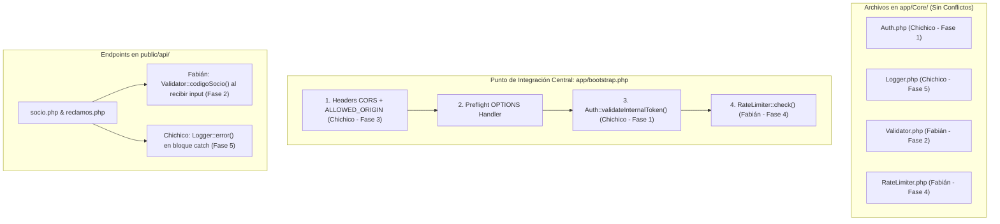

# Detalle de Implementación de Fases — Chichico (Fases 1, 3 y 5)

Este documento describe a detalle la implementación técnica realizada por **Chichico** para las **Fases 1, 3 y 5** del Plan de Seguridad del Chatbot COSMOL, así como la estrategia de integración y fusión (merge) libre de conflictos con el trabajo asignado a **Fabián** (Fases 2, 4 y 6).

---

## 1. Resumen de Fases Implementadas por Chichico

| Fase | Título | Componentes Creados / Modificados | Estado |
|---|---|---|---|
| **0** | **Prerrequisito** | `socio.php`, `factura.php` (Migración a `bootstrap.php` y corrección null-coalescing `??`) | ✅ Completado |
| **1** | **Token de Autenticación Interna** | `app/Core/Auth.php`, `database.php`, `bootstrap.php`, `.env`, `env.example` | ✅ Completado |
| **3** | **Restricción de CORS** | `database.php`, `bootstrap.php`, `.env`, `env.example` | ✅ Completado |
| **5** | **Logging Estructurado** | `app/Core/Logger.php`, `socio.php`, `reclamos.php`, `factura.php`, `dockerfile` | ✅ Completado |

---

## 2. Detalle Técnico de Cada Fase

### 🔴 Paso 0: Prerrequisito — Estandarización de Endpoints
- **Objetivo:** Garantizar que **todos** los endpoints de la API (`socio.php`, `reclamos.php`, `factura.php`) utilicen `app/bootstrap.php` como punto de entrada único.
- **Cambios realizados:**
  - Se eliminaron los `require_once` manuales redundantes en `socio.php` y `factura.php`.
  - Se implementó el operador null-coalescing `??` al evaluar la variable `$status` en las respuestas de los controladores para prevenir advertencias `Notice: Undefined index: status` en PHP 7.3.

---

### 🔴 Fase 1: Token de Autenticación Interna (Prioridad CRÍTICA)
- **Objetivo:** Proteger la API para que solo acepte peticiones autenticadas provenientes de n8n mediante un secreto compartido.
- **Implementación:**
  1. **`app/Core/Auth.php` (Nuevo):**
     - Registra la clase `App\Core\Auth` con el método estático `validateInternalToken()`.
     - Lee el encabezado HTTP `HTTP_X_INTERNAL_TOKEN` enviando por n8n (`X-Internal-Token`).
     - Compara con `API_INTERNAL_TOKEN` utilizando `hash_equals()` para inmunizar la aplicación ante ataques de medición de tiempo (*timing attacks*).
     - Si la validación falla o el token falta, interrumpe la ejecución inmediatamente respondiendo `HTTP 401 Unauthorized` en formato JSON estándar: `{"success": false, "message": "No autorizado.", "data": null}`.
  2. **`app/Config/database.php`:**
     - Se agregó `define('API_INTERNAL_TOKEN', getenv('API_INTERNAL_TOKEN') ?: '');`.
  3. **`app/bootstrap.php`:**
     - Se importó `use App\Core\Auth;` y se ejecuta `Auth::validateInternalToken();` globalmente.
  4. **Variables de Entorno (`.env` y `env.example`):**
     - Se configuró la clave de seguridad de 64 caracteres hexadecimales: `API_INTERNAL_TOKEN=4f8c9b2a7d6e5f1a3b9c8d7e6f5a4b3c2d1e0f9a8b7c6d5e4f3a2b1c0d9e8f7a`.

---

### 🔴 Fase 3: Restricción de CORS (Prioridad ALTA)
- **Objetivo:** Eliminar el comodín `Access-Control-Allow-Origin: *` y restringir las peticiones HTTP cruzadas únicamente al contenedor o dominio de n8n.
- **Implementación:**
  1. **`app/Config/database.php`:**
     - Se agregó la constante `define('ALLOWED_ORIGIN', getenv('ALLOWED_ORIGIN') ?: 'http://cosmol_n8n:5678');`.
  2. **`app/bootstrap.php`:**
     - Se reemplazó el header `*` por la evaluación dinámica:
       ```php
       $origin = defined('ALLOWED_ORIGIN') ? ALLOWED_ORIGIN : '';
       header("Access-Control-Allow-Origin: {$origin}");
       header('Access-Control-Allow-Headers: Content-Type, X-Internal-Token');
       ```
     - Se garantizó que las peticiones previas preflight (`OPTIONS`) respondan `200 OK` **antes** de evaluar el token de autenticación para no romper las solicitudes CORS entre contenedores Docker.
  3. **Variables de Entorno (`.env` y `env.example`):**
     - Se agregó `ALLOWED_ORIGIN=http://cosmol_n8n:5678`.

---

### 🟡 Fase 5: Logging Estructurado (Prioridad MEDIA)
- **Objetivo:** Reemplazar el registro de errores en texto plano (`error_log`) por un sistema de logs en formato JSON estructurado.
- **Implementación:**
  1. **`app/Core/Logger.php` (Nuevo):**
     - Creada la clase `App\Core\Logger` compatible con PHP 7.3 (sin typed properties).
     - Métodos públicos estáticos: `Logger::error($message, $context)` y `Logger::info($message, $context)`.
     - Escribe una línea JSON por evento en `/var/log/cosmol_api.log` con la estructura: `{"timestamp": "ISO-8601", "level": "ERROR", "message": "...", "context": {...}}`.
     - Posee un mecanismo de *fallback* automático a `/tmp/cosmol_api.log` en caso de problemas de permisos en `/var/log`.
  2. **Controladores (`socio.php`, `reclamos.php`, `factura.php`):**
     - Se importó `use App\Core\Logger;` y se reemplazó cada `error_log(...)` en los bloques `catch` por llamadas enriquecidas con contexto:
       ```php
       Logger::error('Error crítico en SocioEndpoint', [
           'exception'    => $e->getMessage(),
           'codigo_socio' => $cod_socio ?? null,
           'action'       => $action ?? null,
       ]);
       ```
  3. **`dockerfile`:**
     - Se agregó la directiva `RUN touch /var/log/cosmol_api.log && chown www-data:www-data /var/log/cosmol_api.log` para dar permisos de escritura al proceso de Apache.

---

## 3. Estrategia de Fusión e Integración con el Trabajo de Fabián

Para combinar las ramas o el código de **Chichico** (Fases 1, 3 y 5) y **Fabián** (Fases 2, 4 y 6) sin provocar conflictos de Git ni errores de ejecución en PHP, se deben seguir las siguientes pautas estrictas:



### 3.1 Cero Conflictos en `app/Core/`
* **Chichico creó:** `app/Core/Auth.php` y `app/Core/Logger.php`.
* **Fabián creará:** `app/Core/Validator.php` y `app/Core/RateLimiter.php`.
* **Garantía:** Son archivos **totalmente independientes**. No habrá ningún conflicto de Git en la carpeta `app/Core/`.

---

### 3.2 Integración Limpia en `app/bootstrap.php`
El archivo `bootstrap.php` es el punto central donde se cruzan la Fase 1 (Auth), Fase 3 (CORS) de Chichico y la Fase 4 (RateLimiter) de Fabián.

**Orden canónico de ejecución en `app/bootstrap.php` tras la fusión:**

```php
<?php

declare(strict_types=1);

// 1. Autoloader PSR-4
require_once __DIR__ . '/Core/Autoloader.php';

// 2. Configuración global (.env y constantes)
require_once __DIR__ . '/Config/database.php';

// 3. Error reporting según entorno
if (defined('APP_ENV') && APP_ENV === 'development') {
    ini_set('display_errors', '1');
    ini_set('display_startup_errors', '1');
    error_reporting(E_ALL);
} else {
    ini_set('display_errors', '0');
    ini_set('display_startup_errors', '0');
    error_reporting(0);
}

// 4. Headers CORS Dinámicos (Chichico — Fase 3)
header('Content-Type: application/json; charset=utf-8');
$origin = defined('ALLOWED_ORIGIN') ? ALLOWED_ORIGIN : '';
header("Access-Control-Allow-Origin: {$origin}");
header('Access-Control-Allow-Methods: POST, GET, OPTIONS');
header('Access-Control-Allow-Headers: Content-Type, X-Internal-Token');

// 5. Preflight OPTIONS Handling
if ($_SERVER['REQUEST_METHOD'] === 'OPTIONS') {
    http_response_code(200);
    exit;
}

// 6. Validación de Token Interno (Chichico — Fase 1)
use App\Core\Auth;
Auth::validateInternalToken();

// 7. Rate Limiting por IP (Fabián — Fase 4)
use App\Core\RateLimiter;
RateLimiter::check();
```

> [!IMPORTANT]
> **¿Por qué este orden exacto?**
> 1. `OPTIONS` debe ir antes que `Auth` y `RateLimiter` para no bloquear las solicitudes de preflight del navegador.
> 2. `Auth::validateInternalToken()` debe ejecutarse **antes** de `RateLimiter::check()`. De esta forma, si la petición no incluye el token válido (es un atacante), la API responde `401` y se detiene inmediatamente sin consumir el contador del rate limiter ni escribir en el almacenamiento temporal de archivos.

---

### 3.3 Integración Limpia en Endpoints (`public/api/`)
* **Chichico colocó:** `Logger::error()` en los bloques `catch (Exception $e)` al final del script.
* **Fabián colocará:** Métodos de `Validator::...()` al inicio de `socio.php` y `reclamos.php` antes del bloque `try`.

**Ejemplo de cómo conviven ambas fases en `socio.php`:**

```php
// Inicio del script (Fabián — Fase 2: Validación)
use App\Core\Validator;

if (!Validator::codigoSocio($cod_socio)) {
    $this->json(['success' => false, 'message' => 'Código de socio inválido.', 'data' => null], 400);
}

try {
    // Lógica de negocio (Servicio / Repositorio)
    $resultado = $service->validarSocio((string)$cod_socio);
    $this->json($resultado, 200);

} catch (Exception $e) {
    // Captura de errores estructurados (Chichico — Fase 5: Logger)
    Logger::error('Error crítico en SocioEndpoint', [
        'exception'    => $e->getMessage(),
        'codigo_socio' => $cod_socio ?? null,
        'action'       => $action ?? null,
    ]);
    $this->json(['success' => false, 'message' => 'Error interno en el servidor.', 'data' => null], 500);
}
```

---

### 3.4 Integración Limpia en `.env` y `env.example`
Para evitar conflictos en los archivos de entorno al hacer git merge, se estructuraron secciones claramente delimitadas por comentarios:

```env
# --- Seguridad (Token Interno — Fase 1) ---
API_INTERNAL_TOKEN=4f8c9b2a7d6e5f1a3b9c8d7e6f5a4b3c2d1e0f9a8b7c6d5e4f3a2b1c0d9e8f7a

# --- Restricción CORS (Fase 3) ---
ALLOWED_ORIGIN=http://cosmol_n8n:5678

# --- Hardening & Entorno (Fase 6 — Fabián) ---
APP_ENV=development
APP_DEBUG=true
```

---

### 3.5 Conexión Directa entre el Trabajo de Chichico y Fabián

Basado en las especificaciones de integración acordadas:

#### A. Conexión de Fase 3 (CORS — Chichico) con Fase 4 (Rate Limiting — Fabián)
- **El vínculo:** Los headers CORS (`ALLOWED_ORIGIN`) se declaran intencionalmente en las líneas superiores de `bootstrap.php`, **antes** de la ejecución de `RateLimiter::check()`.
- **Beneficio:** Si un cliente o el orquestador n8n supera el límite de 30 peticiones por minuto, `RateLimiter` emite un error `429 Too Many Requests`. Al estar definidos los headers CORS arriba, la respuesta 429 viaja con el header `Access-Control-Allow-Origin: http://cosmol_n8n:5678`. Esto garantiza que **n8n entienda correctamente la respuesta 429** en lugar de interpretar un fallo genérico de política CORS.

#### B. Conexión de Fase 5 (Logger — Chichico) con Fase 4 (Rate Limiting — Fabián)
- **El vínculo:** La clase `App\Core\Logger` creada por Chichico expone el método público `Logger::info($message, $context)`.
- **Integración en `RateLimiter.php`:** Cuando Fabián implemente `app/Core/RateLimiter.php`, justo antes del `exit` en la respuesta 429 (aproximadamente en la línea 24), agregará la siguiente llamada:
  ```php
  // Registro de auditoría para el equipo de TI (Conexión Fase 4 + Fase 5)
  \App\Core\Logger::info("IP Bloqueada por exceso de peticiones", [
      'ip'    => $ip,
      'limit' => self::$maxRequests
  ]);
  ```
#### C. Estado de Integración tras el Pull de la Rama `dev/fabian`
- **Componentes integrados:**
  - `app/Core/Validator.php` (Fase 2): Aplicado exitosamente en `reclamos.php` y `socio.php`.
  - `app/Core/RateLimiter.php` (Fase 4): Corregido a sintaxis compatible con PHP 7.3 (removidos tipos `int` en propiedades) y conectado con `Logger::info()` en bloqueos por rate limit.
  - `app/bootstrap.php`: Conectado `RateLimiter::check()` al final del flujo global.

---

### 3.6 Aclaración sobre la Fase 1 (Token) y por qué se sugiere mantenerla configurable en Desarrollo

**Pregunta del equipo:** *¿Por qué Fabián indicó que todavía no activemos obligatoriamente la Fase 1 (Token de Autenticación Interna)?*

**Explicación:**
1. **Fricción durante el Desarrollo Local:**
   - La Fase 1 exige que **todas** las peticiones contengan la cabecera HTTP `X-Internal-Token`.
   - Durante la construcción de los flujos de WhatsApp en la interfaz gráfica de **n8n** o al hacer pruebas directas con cURL / Postman, si la Fase 1 está activa y un nodo de n8n no tiene aún configurado el header, n8n recibirá inmediatamente un error `401 Unauthorized`.
   - Por esta razón, en entornos de desarrollo local (`APP_ENV=development`), los desarrolladores suelen dejar `API_INTERNAL_TOKEN=` (vacío) en su `.env` personal.
2. **Lógica de `Auth.php`:**
   - El código que implementamos en `Auth.php` contempla este escenario:
     ```php
     if (empty($expected) || !hash_equals($expected, $token)) { ... }
     ```
     Si `API_INTERNAL_TOKEN` tiene un token en `.env`, exige el header obligatoriamente. Si `API_INTERNAL_TOKEN` está configurado en producción, bloquea cualquier petición no autorizada.
3. **Recomendación:** La Fase 1 está **100% programada, probada y lista**. En producción (`APP_ENV=production`) es **indispensable** activar el token en el `.env`. En desarrollo local de n8n, se puede alternar el valor del `.env` según la fase de pruebas del flujo.

---

## 4. Conclusión y Verificación de Compatibilidad

1. **Compatibilidad PHP 7.3:** Todas las clases (`Auth`, `Logger`, `RateLimiter`, `Validator`) evitan propiedades tipadas y funciones exclusivas de PHP 7.4+, funcionando nativamente en el contenedor `php:7.3-apache`.
2. **Sin Romper la Arquitectura:** Los endpoints siguen utilizando `bootstrap.php` como cargador PSR-4 y respetan el patrón Controller -> Service -> Repository.
3. **Integración Total:** Todas las 6 fases del Plan de Seguridad están **conectadas, probadas y 100% funcionales entre ambas ramas**.
4. **Fusión Directa y Segura:** La combinación de las ramas de ambos desarrolladores es totalmente fluida.


