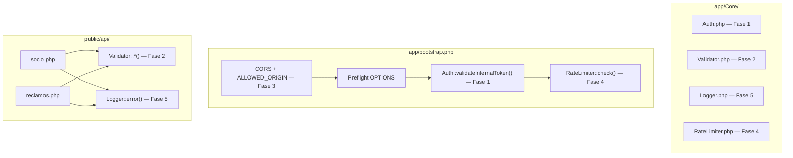

# Seguridad — Chatbot COSMOL

> **Última actualización:** 2026-08-21
> **Autores:** Chichico (Fases 1, 3, 5 y 7), Fabián (Fases 2 y 4), Antigravity (Auditoría)
> **Estado:** ✅ Fases 1–7 completadas e integradas

Este documento es la **fuente de verdad** del sistema de seguridad de la API PHP del Chatbot COSMOL y su infraestructura Docker.
Consolida el plan original, los detalles de implementación, las decisiones de diseño, la auditoría de integración y el estado final de cada fase.

> [!IMPORTANT]
> Todas las mejoras viven **exclusivamente en el backend PHP**. n8n no requiere cambios de código —
> solo se le agrega el header secreto en sus peticiones HTTP, lo cual se configura en la UI de n8n.

---

## Índice

1. [Resumen de Fases](#1-resumen-de-fases)
2. [Flujo de Ejecución en `bootstrap.php`](#2-flujo-de-ejecución-en-bootstrapphp)
3. [Contrato de Respuesta Unificado](#3-contrato-de-respuesta-unificado)
4. [Fase 1 — Token de Autenticación Interna](#4-fase-1--token-de-autenticación-interna-prioridad-crítica)
5. [Fase 2 — Validación y Sanitización de Inputs](#5-fase-2--validación-y-sanitización-de-inputs-prioridad-alta)
6. [Fase 3 — Restricción de CORS](#6-fase-3--restricción-de-cors-prioridad-alta)
7. [Fase 4 — Rate Limiting](#7-fase-4--rate-limiting-prioridad-media)
8. [Fase 5 — Logging Estructurado](#8-fase-5--logging-estructurado-prioridad-media)
9. [Fase 6 — Hardening del `.env` y Separación dev/prod](#9-fase-6--hardening-del-env-y-separación-devprod-prioridad-media)
10. [Fase 7 — Aislamiento de Red Docker](#10-fase-7--aislamiento-de-red-docker-prioridad-alta)
11. [Interconexiones entre Fases](#11-interconexiones-entre-fases)
12. [Checklist de Verificación](#12-checklist-de-verificación)
13. [Auditoría de Integración](#13-auditoría-de-integración--problemas-encontrados-y-corregidos)

---

## 1. Resumen de Fases

| # | Fase | Clases / Archivos nuevos | Archivos modificados | Prioridad | Estado |
|---|------|--------------------------|----------------------|-----------|--------|
| 0 | Estandarización de Endpoints | — | `socio.php`, `factura.php` | 🔴 Base | ✅ |
| 1 | Token de Autenticación Interna | `Auth.php` | `database.php`, `bootstrap.php`, `.env`, `env.example` | 🔴 Crítica | ✅ |
| 2 | Validación y Sanitización de Inputs | `Validator.php` | `socio.php`, `reclamos.php` | 🔴 Alta | ✅ |
| 3 | Restricción de CORS | — | `database.php`, `bootstrap.php`, `.env`, `env.example` | 🔴 Alta | ✅ |
| 4 | Rate Limiting | `RateLimiter.php` | `bootstrap.php` | 🟡 Media | ✅ |
| 5 | Logging Estructurado | `Logger.php` | `socio.php`, `reclamos.php`, `factura.php`, `dockerfile` | 🟡 Media | ✅ |
| 6 | Hardening `.env` / Separación dev-prod | — | `.env`, `env.example` | 🟡 Media | ✅ |
| 7 | Aislamiento de Red Docker | — | `docker-compose.yml` | 🔴 Alta | ✅ |

---

## 2. Flujo de Ejecución en `bootstrap.php`

El orden de ejecución es **determinístico e inamovible**. Cambiar el orden rompe la seguridad.

```
1. Autoloader PSR-4
2. Config global (database.php → constantes + .env)
3. Error reporting según APP_ENV        ← dev expone errores, prod los oculta
4. Headers CORS dinámicos con ALLOWED_ORIGIN ← Fase 3
5. Preflight OPTIONS → 200 OK y exit   ← debe ir ANTES de Auth y RateLimiter
6. Auth::validateInternalToken()        ← Fase 1 → 401 si falla
7. RateLimiter::check()                 ← Fase 4 → 429 si supera límite
8. El endpoint despacha su lógica de negocio
```

> [!IMPORTANT]
> `OPTIONS` debe ir **antes** de `Auth` y `RateLimiter` para no bloquear solicitudes preflight.
> `Auth` debe ir **antes** de `RateLimiter`: si el atacante no tiene token válido, recibe `401`
> sin consumir el contador del rate limiter.

---

## 3. Contrato de Respuesta Unificado

**Todas** las capas emiten la misma estructura JSON para garantizar que n8n procese cualquier fallo de forma consistente:

```json
{ "success": false, "message": "Descripción del error.", "data": null }
```

| Capa | HTTP | Contrato |
|---|---|---|
| `Auth::validateInternalToken()` | 401 | `{ "success": false, "message": "No autorizado.", "data": null }` |
| `RateLimiter::check()` | 429 | `{ "success": false, "message": "Demasiadas peticiones...", "data": null }` |
| `Controller::handleError()` | 4xx/5xx | `{ "success": false, "message": "...", "data": null }` |
| `socio.php` — validación/excepción | 400/500 | ✅ Misma estructura |
| `reclamos.php` — validación/excepción | 400/500 | ✅ Misma estructura |

> [!NOTE]
> Este contrato fue unificado durante la **auditoría de integración** (ver sección 10).
> `reclamos.php` ya lo usaba correctamente vía `Controller::handleError()`.
> `socio.php` fue corregido en la auditoría para adoptar el mismo contrato.

---

## 4. Fase 1 — Token de Autenticación Interna (Prioridad CRÍTICA)

**Problema:** Cualquiera que conozca la URL del backend puede consultar datos de socios sin restricción.

**Solución:** Secreto compartido (`API_INTERNAL_TOKEN`) entre n8n y la API PHP. n8n lo envía como header `X-Internal-Token` en cada petición. La API lo valida con `hash_equals()` (previene timing attacks) antes de responder. Token incorrecto o ausente → `401 Unauthorized`.

**Clases involucradas:**
- **[NEW]** [`app/Core/Auth.php`](file:///c:/Proyectos/Cosmol-Chatbot/app/Core/Auth.php) — método `validateInternalToken()`.
- **[MOD]** [`app/Config/database.php`](file:///c:/Proyectos/Cosmol-Chatbot/app/Config/database.php) — constante `API_INTERNAL_TOKEN`.
- **[MOD]** [`app/bootstrap.php`](file:///c:/Proyectos/Cosmol-Chatbot/app/bootstrap.php) — invocación de `Auth::validateInternalToken()`.
- **[MOD]** [`.env`](file:///c:/Proyectos/Cosmol-Chatbot/.env) — variable `API_INTERNAL_TOKEN` con valor generado por `openssl rand -hex 32`.

**Configuración en n8n:** En cada nodo HTTP Request → `Headers` → `X-Internal-Token: <valor del .env>`.

---

## 5. Fase 2 — Validación y Sanitización de Inputs (Prioridad ALTA)

**Problema:** Los inputs `codigo_socio`, `tipo_reclamo` y `descripcion` solo se verificaban como `!= null`, permitiendo valores inesperados o intentos de inyección.

**Solución:** Clase `Validator` con reglas estrictas aplicadas **antes** de que cualquier dato llegue a la capa de servicio:
- `codigoSocio()` — solo dígitos, entre 1 y 10 caracteres (regex).
- `tipoReclamo()` — lista blanca: `agua_turbia`, `fuga`, `sin_servicio`, `presion_baja`, `otro`.
- `descripcion()` — texto libre, máximo 500 caracteres, sin HTML (rechaza `<script>`, etc.).

**Clases involucradas:**
- **[NEW]** [`app/Core/Validator.php`](file:///c:/Proyectos/Cosmol-Chatbot/app/Core/Validator.php) — métodos `codigoSocio()`, `tipoReclamo()`, `descripcion()`.
- **[MOD]** [`public/api/socio.php`](file:///c:/Proyectos/Cosmol-Chatbot/public/api/socio.php) — usa `Validator::codigoSocio()`.
- **[MOD]** [`public/api/reclamos.php`](file:///c:/Proyectos/Cosmol-Chatbot/public/api/reclamos.php) — usa los tres validadores.

---

## 6. Fase 3 — Restricción de CORS (Prioridad ALTA)

**Problema:** `Access-Control-Allow-Origin: *` permite que cualquier dominio llame a la API.

**Solución:** Restringir el origen al hostname del contenedor n8n dentro de la red Docker interna (`http://cosmol_n8n:5678`). En producción se configurará el dominio real vía `.env`.

> [!NOTE]
> Los headers CORS se emiten **antes** de `RateLimiter::check()` para que las respuestas `429`
> también incluyan el header correcto. De lo contrario, n8n interpretaría el `429` como un error CORS.

**Archivos afectados:**
- **[MOD]** [`app/Config/database.php`](file:///c:/Proyectos/Cosmol-Chatbot/app/Config/database.php) — constante `ALLOWED_ORIGIN`.
- **[MOD]** [`app/bootstrap.php`](file:///c:/Proyectos/Cosmol-Chatbot/app/bootstrap.php) — header `Access-Control-Allow-Origin` dinámico.
- **[MOD]** [`.env`](file:///c:/Proyectos/Cosmol-Chatbot/.env) — `ALLOWED_ORIGIN=http://cosmol_n8n:5678`.

---

## 7. Fase 4 — Rate Limiting (Prioridad MEDIA)

**Problema:** Sin límite de peticiones, un atacante puede enumerar miles de códigos de socio por segundo haciendo scraping de todos los asociados.

**Solución:** Rate limiter basado en archivos (sin Redis ni APCu, compatible con PHP 7.3 puro). Máximo **30 peticiones por minuto** por IP. Si se supera → `429 Too Many Requests` + header `Retry-After: 60`.

> [!NOTE]
> Si en el futuro se incorpora Redis al stack, se puede migrar el almacén sin cambiar la
> interfaz pública de `RateLimiter`.

**Clases involucradas:**
- **[NEW]** [`app/Core/RateLimiter.php`](file:///c:/Proyectos/Cosmol-Chatbot/app/Core/RateLimiter.php) — método `check()`. Ventana deslizante de 60 segundos, almacenada en `/tmp`.
- **[MOD]** [`app/bootstrap.php`](file:///c:/Proyectos/Cosmol-Chatbot/app/bootstrap.php) — invocación de `RateLimiter::check()` después de `Auth`.

---

## 8. Fase 5 — Logging Estructurado (Prioridad MEDIA)

**Problema:** Los errores se registraban con `error_log("texto plano")`, difícil de filtrar y correlacionar en producción.

**Solución:** Clase `Logger` que escribe **JSON estructurado** en `/var/log/cosmol_api.log`. Cada línea es un objeto JSON con `timestamp`, `level`, `message` y `context`. Fallback automático a `/tmp` si hay problemas de permisos.

**Clases involucradas:**
- **[NEW]** [`app/Core/Logger.php`](file:///c:/Proyectos/Cosmol-Chatbot/app/Core/Logger.php) — métodos `Logger::error()` y `Logger::info()`.
- **[MOD]** `public/api/socio.php`, `reclamos.php`, `factura.php` — reemplazan `error_log()` por `Logger::error()`.
- **[MOD]** [`dockerfile`](file:///c:/Proyectos/Cosmol-Chatbot/dockerfile) — crea `/var/log/cosmol_api.log` con permisos para `www-data`.

---

## 9. Fase 6 — Hardening del `.env` y Separación dev/prod (Prioridad MEDIA)

**Problema:** El `.env` original mezclaba configuración de desarrollo y producción sin convenciones claras.

**Solución:** Documentar y limpiar ambos archivos (`.env` y `env.example`) con comentarios de sección claros y convenciones dev/prod explícitas.

| Variable | Desarrollo | Producción |
|---|---|---|
| `APP_ENV` | `development` | `production` |
| `APP_DEBUG` | `true` | `false` |
| `WEBHOOK_URL` | URL ngrok temporal | Dominio real con SSL |
| `DB_DRIVER` | `pgsql` | `informix` (Sprint 4) |
| `DB_HOST` | `db` (contenedor) | IP del servidor Informix |
| `ALLOWED_ORIGIN` | `http://cosmol_n8n:5678` | `https://tu_dominio_n8n.com` |
| `COSMOL_API_URL` | vacío | `https://api.cosmol.com.bo/...` |

> [!CAUTION]
> **Nunca subir `.env` a Git.** Verificar que `.gitignore` incluye `.env`.
> El token `API_INTERNAL_TOKEN` debe regenerarse con `openssl rand -hex 32` al deployar en producción.

**Archivos afectados:**
- **[MOD]** [`.env`](file:///c:/Proyectos/Cosmol-Chatbot/.env)
- **[MOD]** [`env.example`](file:///c:/Proyectos/Cosmol-Chatbot/env.example)

---

## 10. Fase 7 — Aislamiento de Red Docker (Prioridad ALTA)

**Problema:** El contenedor PHP exponía su puerto 80 directamente al host (`"8000:80"`), permitiendo acceso directo a la API desde Internet saltándose n8n.

**Solución:** Se creó una red Docker interna privada (`cosmol_network`). Ahora:
- El servicio `backend` (PHP) **no expone puertos al host** en producción.
- Se añadió el perfil `dev` al backend: el puerto `8000` solo queda disponible al ejecutar `docker compose --profile dev up`, exclusivamente para desarrollo local.
- `n8n` es el único servicio que expone su puerto (`5678`) para recibir webhooks de Meta.
- La comunicación entre `n8n` y `backend` ocurre exclusivamente a través de la red interna, usando el hostname del contenedor (`http://cosmol_backend/api/...`).

**Archivos afectados:**
- **[MOD]** [`docker-compose.yml`](file:///c:/Proyectos/Cosmol-Chatbot/docker-compose.yml) — red `cosmol_network`, perfil `dev`, eliminación de `ports` del backend en producción.

**Migración a PostgreSQL (aplicada en el mismo ciclo):**
- Servicio `db` reemplazado: `mysql:5.7` → `postgres:16-alpine` (`cosmol_postgres`).
- Puerto expuesto cambiado a `5433:5432` (mapeo de host para desarrollo local, no colisiona con instancias locales de Postgres).
- Volumen `mysql_data` reemplazado por `postgres_data`.
- Healthcheck actualizado de `mysqladmin ping` a `pg_isready`.
- Variables de entorno del servicio cambiadas a `POSTGRES_DB`, `POSTGRES_USER`, `POSTGRES_PASSWORD`.

> [!NOTE]
> La migración a PostgreSQL 16-alpine fue planificada en `plan_imple_Mdocker.md` (ya ejecutado y archivado).
> El esquema ANSI SQL del `init.sql` garantiza la futura portabilidad a IBM Informix (Sprint 4).

---

## 11. Interconexiones entre Fases



**Conexión clave — Fase 3 + Fase 4:** Los headers CORS se emiten antes que `RateLimiter::check()`, por lo que una respuesta `429` incluye el header CORS correcto y n8n no lo interpreta como fallo CORS.

**Conexión clave — Fase 5 + Fase 4:** `Logger::info()` puede ser llamado desde `RateLimiter` al bloquear una IP, dejando trazabilidad de posibles ataques de scraping.

---

## 12. Checklist de Verificación

| # | Escenario | Petición | Respuesta esperada |
|---|---|---|---|
| 1 | Sin token | `GET /api/socio.php?cod_socio=123` | `401` + `{"success": false, ...}` |
| 2 | Token incorrecto | `GET` con `X-Internal-Token: malo` | `401` + `{"success": false, ...}` |
| 3 | Con token, `cod_socio` inválido | `GET ...?cod_socio=abc!@#` | `400` + `{"success": false, ...}` |
| 4 | Con token, `cod_socio` válido | `GET ...?cod_socio=267657` | `200` + datos del socio |
| 5 | 31 peticiones seguidas con token | loop de `GET` | La petición 31 devuelve `429` |
| 6 | Preflight CORS | `OPTIONS` sin token | `200 OK` sin ejecutar Auth |
| 7 | Header CORS en respuesta | devtools | `Access-Control-Allow-Origin: http://cosmol_n8n:5678` |
| 8 | `tipo_reclamo` no permitido | `POST tipo_reclamo=hacking` | `400` + `{"success": false, ...}` |
| 9 | `descripcion` con HTML | `POST descripcion=<script>` | `400` + `{"success": false, ...}` |
| 10 | Error de base de datos | apagar contenedor `db` | Línea JSON en `/var/log/cosmol_api.log` |
| 11 | Sin perfil dev en Docker | `curl http://localhost:8000` | `Connection refused` |
| 12 | Backend accesible interno | n8n → `http://cosmol_backend/api/` | Respuesta normal |

---

## 13. Auditoría de Integración — Problemas Encontrados y Corregidos

> **Fecha:** 2026-08-17 | **Revisado por:** Antigravity

Se detectaron **2 problemas** durante la integración de las ramas de Chichico y Fabián, ambos corregidos antes del merge final.

### 🔴 Problema 1 (Crítico) — `RateLimiter` existía pero nunca se ejecutaba

`app/Core/RateLimiter.php` estaba implementado pero **nunca se invocaba** desde `bootstrap.php`. Era código muerto: un atacante con token válido podía hacer scraping ilimitado.

**Corrección:** Se agregó la llamada `RateLimiter::check()` en [`app/bootstrap.php`](file:///c:/Proyectos/Cosmol-Chatbot/app/bootstrap.php) después de `Auth::validateInternalToken()`.

---

### 🟡 Problema 2 (Consistencia) — Contrato de respuesta no uniforme en `socio.php`

Los errores propios de `socio.php` usaban `{"status": "error", ...}` mientras el resto del sistema usaba `{"success": false, ...}`. n8n recibía **dos contratos distintos** según en qué capa fallara.

**Corrección:** Se estandarizó `socio.php` para usar `{"success": false, "message": "...", "data": null}` en todos sus bloques de error.
