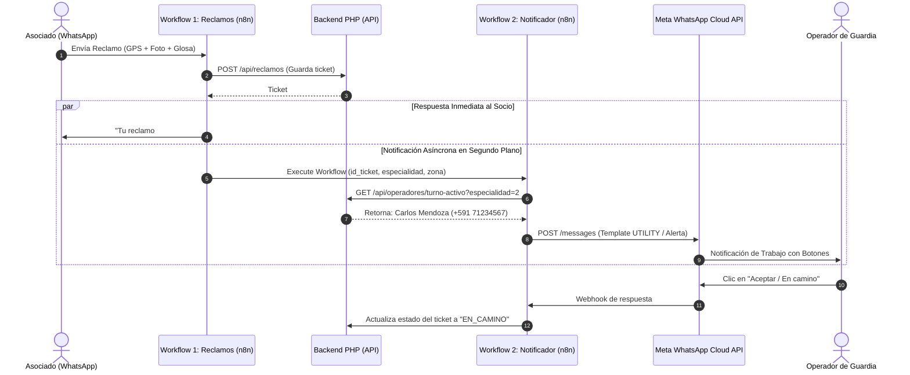

# Propuesta Arquitectónica: Notificaciones Proactivas a Operadores por WhatsApp

> **Documento de Especificación y Diseño Futuro**  
> **Sistema:** COSMOL Chatbot & COSMOL Reportes  
> **Fecha:** Septiembre 2026  
> **Estado:** Propuesta de Integración Futura  

---

## 1. Resumen Ejecutivo y Objetivo

El objetivo de esta integración es que, cada vez que un asociado de **COSMOL** registre exitosamente un **Reclamo Técnico** (fuga de agua, rotura de matriz, desborde de alcantarilla) o una **Solicitud de Reconexión**, el sistema notifique de manera **inmediata y automática por WhatsApp al trabajador u operador de campo asignado**, considerando su **especialidad** y su **turno de guardia activo**.

Esta funcionalidad cierra la brecha entre la atención al cliente y la operación en campo, reduciendo drásticamente los tiempos de respuesta y ofreciendo trazabilidad en tiempo real.

---

## 2. Viabilidad y Políticas de Meta WhatsApp Cloud API

### ¿Es técnicamente posible?
**Sí, es 100% viable**, pero debe diseñarse respetando las normativas estrictas de la **Meta WhatsApp Business Cloud API**.

### 2.1 Desmitificando los Límites y la Gratuidad de Meta (Cero Confusiones)

Existen dos conceptos que frecuentemente se confunden en Meta:

```
┌─────────────────────────────────────────────────────────────────────────┐
│                    CONCEPTOS DISTINTOS EN META WABA                     │
├────────────────────────────────────┬────────────────────────────────────┤
│    1. LÍMITES DE ENVÍO (TIERS)     │   2. BOLSA GRATUITA Y FACTURACIÓN  │
├────────────────────────────────────┼────────────────────────────────────┤
│ • Tier No Verificado: 250 envíos/día│ • 1,000 Conversaciones GRATIS al   │
│ • Tier 1 (Verificado): 1,000/día   │   mes (Solo para Servicio al socio)│
│ • Tier 2: 10,000/día               │ • Plantillas fuera de ventana:     │
│ • ¡NO LIMITA MENSAJES DE SOCIOS!   │   Tienen costo (~0.10 Bs por 24h)  │
└────────────────────────────────────┴────────────────────────────────────┘
```

#### A. El Límite de Envío Diario (Tiers: 250, 1,000, 10,000...)
* **¿Qué limita?:** La cantidad de clientes **distintos** a los que la **empresa puede escribirles primero (salida)** en 24 horas.
* **¿Afecta a los socios entrantes?:** **NO.** Si 10,000 socios le escriben a COSMOL en un día para consultar saldo, el bot puede atender a los 10,000 sin ningún límite de tier. Meta jamás rechaza a un usuario que le escribe a la empresa.
* **Estado actual de COSMOL:** Como la cuenta está en proceso de verificación empresarial, se encuentra en el límite inicial (250/día). Al aprobarse la verificación, subirá automáticamente a **Tier 1 (1,000/día)**.

#### B. La Regla de la Ventana de 24 Horas
* Cuando un **socio** le escribe al bot, se abre una ventana de atención de 24 horas en la que el bot puede responderle con mensajes de texto libre o interactivos.
* Con los **trabajadores/operadores**, la situación es distinta: si el operador no le ha escrito al bot recientemente, la ventana de 24 horas está cerrada (*Out-of-session*).
* **Regla estricta:** Para iniciar contacto con el operador fuera de ventana, es **obligatorio utilizar una Plantilla Preaprobada (Message Template)** de categoría **`UTILITY`**.

---

## 3. Análisis de Costos y Casos de Uso para Notificar al Operador

Para que la directiva y el equipo técnico tengan total claridad sobre cuándo hay cobro y cómo evitarlo, se definen **dos casos de uso arquitectónicos**:

### 🔴 Caso de Uso 1: Disparo Proactivo en Frío (Business-Initiated) — *Con Costo Mínimo*

* **Escenario:** El trabajador entra a su guardia, pero **no le escribe al bot**. A las 9:00 AM un socio reporta una fuga grave. El sistema busca al operador en la base de datos y le dispara la plantilla por WhatsApp.
* **¿Meta cobra este mensaje?:** **SÍ.**
  * Como la empresa inició el contacto fuera de ventana, Meta factura la conversación de tipo `UTILITY`.
  * **Tarifa para Bolivia:** Aproximadamente **$0.015 USD** (entre **0.10 y 0.12 Bolivianos**).
  * **La regla de las 24 horas protege a la cooperativa:**  
    Meta cobra **por sesión de 24 horas, NO por cada mensaje**.  
    Si a ese mismo operador le llegan 10 reclamos más durante ese día (a las 11 AM, 2 PM, 5 PM), **los siguientes 10 mensajes son 100% GRATIS ($0.00)** porque ya pagaste la ventana de 24 horas de ese operador.
  * **Gasto mensual estimado:** Con 3 o 4 cuadrillas activas al día, el costo total mensual ronda entre **$1.50 y $3.00 USD al mes** (~15 a 25 Bs/mes).

---

### 🟢 Caso de Uso 2: "Check-in" de Guardia / Inicio de Turno (User-Initiated) — *100% GRATIS*

* **Escenario:** Al llegar a su turno a las 8:00 AM, el operador de guardia abre el WhatsApp corporativo y presiona un botón o escribe:  
  👉 *"Iniciar Guardia / Turno"*.
* **¿Qué ocurre internamente en Meta?:**  
  Al ser el **trabajador quien le escribió primero al bot**, Meta clasifica la conversación como **Iniciada por el Usuario (Servicio)**.
* **Beneficios de este caso de uso:**
  1. **Costo $0.00 USD:** Entra dentro de las **1,000 conversaciones gratuitas mensuales** que Meta otorga a la cooperativa.
  2. **Abre la ventana de 24 horas:** El bot valida su rol ("Bienvenido Juan, turno de Alcantarillado activo").
  3. **Alertas ilimitadas sin costo:** Durante las siguientes 24 horas, todos los reclamos, fotos y reconexiones que el sistema le envíe a Juan Perez son **100% GRATUITOS**.
  4. **Acuse de asistencia:** Funciona además como confirmación en tiempo real de que el operador ya tiene su celular encendido y listo para recibir asignaciones.

---

## 4. Comparativa de Casos de Uso

| Aspecto | Caso 1: Disparo en Frío | Caso 2: Check-in de Turno (Recomendado) |
|---|---|---|
| **Quién inicia la conversación** | El sistema / Bot | El operador al entrar a guardia |
| **Tipo de mensaje inicial** | Plantilla `UTILITY` preaprobada | Mensaje libre / Botón del bot |
| **Costo para COSMOL** | ~$0.10 Bs por operador por día | **$0.00 (Gratis en las 1,000 mensuales)** |
| **Reclamos posteriores en el día** | Gratuitos (ventana abierta de 24h) | Gratuitos (ventana abierta de 24h) |
| **Intervención del operador** | Cero (recibe el mensaje pasivamente) | 1 clic al iniciar su guardia |
| **Riesgo de que el cel esté apagado** | Alto (no sabes si está conectado) | Bajo (confirmó asistencia con el check-in) |

---

## 5. Arquitectura Técnica Modular (Backend PHP + n8n)

Para garantizar estabilidad y rendimiento, **la notificación a operadores debe desacoplarse totalmente del flujo del socio**. El socio no debe esperar que Meta contacte al operador para recibir su confirmación.



---

## 6. Diseño de Base de Datos: Tabla de Turnos de Operadores

Para que el backend sepa a quién notificar en tiempo real según la especialidad y el horario, se implementará la siguiente tabla en PostgreSQL:

```sql
CREATE TABLE IF NOT EXISTS turno_operador (
    id_turno SERIAL PRIMARY KEY,
    id_usuario INT NOT NULL,                     -- FK a tabla usuario en COSMOL-Reportes
    nombre_operador VARCHAR(150) NOT NULL,
    telefono_whatsapp VARCHAR(25) NOT NULL,      -- Formato internacional E.164: ej. '59171234567'
    id_especialidad INT NOT NULL,                -- 1: Reconexión | 2: Alcantarillado | 3: Agua Potable
    zona_asignada VARCHAR(100) DEFAULT 'GENERAL',-- Opcional: filtro por zonas o distritos
    fecha_inicio TIMESTAMP NOT NULL,             -- Inicio de guardia (ej. 2026-09-10 08:00:00)
    fecha_fin TIMESTAMP NOT NULL,                -- Fin de guardia (ej. 2026-09-10 20:00:00)
    estado VARCHAR(20) DEFAULT 'ACTIVO'          -- 'ACTIVO', 'EN_DESCANSO', 'FINALIZADO'
);

-- Índice optimizado para consulta instantánea por especialidad y fecha actual
CREATE INDEX IF NOT EXISTS idx_turno_activo 
ON turno_operador (id_especialidad, estado, fecha_inicio, fecha_fin);
```

### Consulta ejecutada por el sistema al crearse un reclamo:
```sql
SELECT telefono_whatsapp, nombre_operador 
FROM turno_operador 
WHERE id_especialidad = :id_especialidad 
  AND estado = 'ACTIVO' 
  AND CURRENT_TIMESTAMP BETWEEN fecha_inicio AND fecha_fin
LIMIT 1;
```

---

## 7. Modularización en el Código

### 7.1 En Cosmol-Chatbot (Backend PHP)
Se crea un módulo aislado bajo el principio de responsabilidad única:
* `app/Modules/Notificaciones/NotificacionOperadorService.php`: Orquesta el armado del payload y la conexión con Meta.
* `app/Modules/Notificaciones/TurnoService.php`: Consulta los operadores en turno.
* `app/Data/Repositories/Postgres/TurnoOperadorRepository.php`: Consultas SQL a la tabla de turnos.

### 7.2 En n8n (Workflows Separados)
* **Workflow Principal:** `03_Modulo_Reclamos.json` (Atención al cliente).
* **Sub-Workflow Secundario:** `06_Notificador_Operador_Turno.json`.
  * Invocado mediante el nodo **`Execute Workflow`**.
  * Si la API de Meta experimenta micro-cortes, n8n reintenta el envío a través de reintentos automáticos (*Retry on Fail*) sin afectar en lo absoluto la conversación con el socio.

---

## 8. Diseño de la Plantilla en Meta Business Manager

* **Nombre de la plantilla:** `notificacion_reclamo_operador`
* **Categoría:** `UTILITY`
* **Idioma:** Español (`es`)
* **Cuerpo del Mensaje:**
  > 🚨 *COSMOL - Nueva Asignación de Trabajo*  
  >  
  > Hola **{{1}}**, se ha generado un nuevo ticket de atención técnica:  
  >  
  > 📋 *Tipo:* {{2}}  
  > 👤 *Socio:* {{3}} (Cód: {{4}})  
  > 📍 *Ubicación:* Zona {{5}}, Ruta {{6}}  
  > 📝 *Detalle:* {{7}}  
  >  
  > Revisa los datos y coordenadas completas en tu panel operativo.
* **Botones Interactivos:**
  1. **URL Dinámica:** `Ver Detalle` ➔ `https://chatbot.cosmol.com.bo:8081/operador/detalle?id={{8}}`
  2. **Respuesta Rápida:** `Aceptar / En camino`

---

## 9. Resumen y Hoja de Ruta de Implementación

1. **Aprobación de la Verificación de Meta:** Esperar la respuesta oficial del Business Manager para desbloquear Tier 1 (1,000 conversaciones/día).
2. **Creación de Plantilla `UTILITY`:** Registrar el template en la consola de Meta para aprobación (proceso de 1 hora).
3. **Módulo de Turnos en Base de Datos:** Crear la tabla `turno_operador` e incorporar los números de teléfono de las cuadrillas.
4. **Sub-Workflow en n8n:** Importar el workflow `06` para el envío en segundo plano.
5. **Elección Operativa de COSMOL:**
   - Si se elige el **Caso 2 (Check-in de turno)**: Se ahorra el 100% de costos usando las 1,000 gratuitas.
   - Si se elige el **Caso 1 (Disparo en frío)**: Se gasta un promedio de solo 20 a 30 Bs mensuales en plantillas para toda la empresa.
