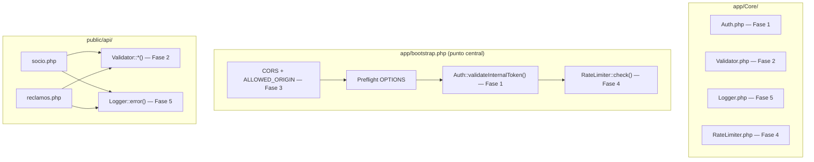

# Implementación de Seguridad — Chatbot COSMOL

> **Última actualización:** 2026-08-17
> **Autores:** Chichico (Fases 1, 3 y 5), Fabián (Fases 2 y 4), Antigravity (Auditoría y Fase 6)
> **Estado:** ✅ Fases 1–6 completadas e integradas

Este documento es la **fuente de verdad** del sistema de seguridad de la API PHP del Chatbot COSMOL.
Consolida el plan original, los detalles de implementación, las decisiones de diseño, la auditoría de
integración y el estado final de cada fase.

> [!IMPORTANT]
> Todas las mejoras viven **exclusivamente en el backend PHP**. n8n no requiere cambios de código —
> solo se le agrega el header secreto en sus peticiones HTTP, lo cual se configura directamente en
> la UI de n8n.

---

## Índice

1. [Resumen de Fases](#1-resumen-de-fases)
2. [Flujo de Ejecución en bootstrap.php](#2-flujo-de-ejecución-en-bootstrapphp)
3. [Contrato de Respuesta Unificado](#3-contrato-de-respuesta-unificado)
4. [Fase 1 — Token de Autenticación Interna](#4-fase-1--token-de-autenticación-interna-prioridad-crítica)
5. [Fase 2 — Validación y Sanitización de Inputs](#5-fase-2--validación-y-sanitización-de-inputs-prioridad-alta)
6. [Fase 3 — Restricción de CORS](#6-fase-3--restricción-de-cors-prioridad-alta)
7. [Fase 4 — Rate Limiting](#7-fase-4--rate-limiting-prioridad-media)
8. [Fase 5 — Logging Estructurado](#8-fase-5--logging-estructurado-prioridad-media)
9. [Fase 6 — Hardening del .env y Separación dev/prod](#9-fase-6--hardening-del-env-y-separación-devprod-prioridad-media)
10. [Interconexiones entre Fases](#10-interconexiones-entre-fases)
11. [Checklist de Verificación](#11-checklist-de-verificación)
12. [Auditoría de Integración — Problemas Encontrados y Corregidos](#12-auditoría-de-integración--problemas-encontrados-y-corregidos)

---

## 1. Resumen de Fases

| # | Fase | Archivos nuevos | Archivos modificados | Prioridad | Estado |
|---|------|----------------|---------------------|-----------|--------|
| 0 | Prerrequisito — Estandarización de Endpoints | — | `socio.php`, `factura.php` | 🔴 Base | ✅ |
| 1 | Token de Autenticación Interna | `Auth.php` | `database.php`, `bootstrap.php`, `.env`, `env.example` | 🔴 Crítica | ✅ |
| 2 | Validación y Sanitización de Inputs | `Validator.php` | `socio.php`, `reclamos.php` | 🔴 Alta | ✅ |
| 3 | Restricción de CORS | — | `database.php`, `bootstrap.php`, `.env`, `env.example` | 🔴 Alta | ✅ |
| 4 | Rate Limiting | `RateLimiter.php` | `bootstrap.php` | 🟡 Media | ✅ |
| 5 | Logging Estructurado | `Logger.php` | `socio.php`, `reclamos.php`, `factura.php`, `dockerfile` | 🟡 Media | ✅ |
| 6 | Hardening `.env` / Separación dev-prod | — | `.env`, `env.example` | 🟡 Media | ✅ |

---

## 2. Flujo de Ejecución en bootstrap.php

El orden canónico de ejecución es **determinístico e inamovible**. Cambiar el orden rompe la seguridad.

```
1. Autoloader PSR-4
2. Config global (database.php → constantes + .env)
3. Error reporting según APP_ENV            ← dev expone errores, prod los oculta
4. Headers CORS dinámicos con ALLOWED_ORIGIN ← Fase 3 (Chichico)
5. Preflight OPTIONS → 200 OK y exit        ← debe ir ANTES de Auth y RateLimiter
6. Auth::validateInternalToken()            ← Fase 1 (Chichico) → 401 si falla
7. RateLimiter::check()                     ← Fase 4 (Fabián)   → 429 si supera límite
8. El endpoint despacha su lógica de negocio
```

> [!IMPORTANT]
> **¿Por qué este orden exacto?**
> - `OPTIONS` debe ir **antes** de `Auth` y `RateLimiter` para no bloquear solicitudes preflight del navegador.
> - `Auth` debe ir **antes** de `RateLimiter`: si el atacante no tiene token válido, recibe `401` y se detiene
>   sin consumir el contador del rate limiter ni escribir en `/tmp`.

El código real implementado en [`bootstrap.php`](file:///c:/Proyectos/Cosmol-Chatbot/app/bootstrap.php):

```php
<?php
declare(strict_types=1);

require_once __DIR__ . '/Core/Autoloader.php';
require_once __DIR__ . '/Config/database.php';

// 3. Error reporting según entorno
if (defined('APP_ENV') && APP_ENV === 'development') {
    ini_set('display_errors', '1');
    ini_set('display_startup_errors', '1');
    error_reporting(E_ALL);
} else {
    ini_set('display_errors', '0');
    ini_set('display_startup_errors', '0');
    error_reporting(0);
}

// 4. Headers CORS dinámicos [FASE 3]
header('Content-Type: application/json; charset=utf-8');
$origin = defined('ALLOWED_ORIGIN') ? ALLOWED_ORIGIN : '';
header("Access-Control-Allow-Origin: {$origin}");
header('Access-Control-Allow-Methods: POST, GET, OPTIONS');
header('Access-Control-Allow-Headers: Content-Type, X-Internal-Token');

// 5. Preflight
if ($_SERVER['REQUEST_METHOD'] === 'OPTIONS') {
    http_response_code(200);
    exit;
}

// 6. Validación de token interno [FASE 1]
use App\Core\Auth;
Auth::validateInternalToken();

// 7. Rate Limiting por IP [FASE 4]
use App\Core\RateLimiter;
RateLimiter::check();
```

---

## 3. Contrato de Respuesta Unificado

**Todas** las capas del sistema emiten la misma estructura JSON para errores, garantizando que n8n
pueda procesar cualquier respuesta de fallo de forma consistente:

```json
{ "success": false, "message": "Descripción del error.", "data": null }
```

| Capa | HTTP | Contrato |
|---|---|---|
| `Auth::validateInternalToken()` | 401 | `{ "success": false, "message": "No autorizado.", "data": null }` |
| `RateLimiter::check()` | 429 | `{ "success": false, "message": "Demasiadas peticiones...", "data": null }` |
| `Controller::handleError()` | 4xx/5xx | `{ "success": false, "message": "...", "data": null }` |
| `socio.php` — validación | 400 | `{ "success": false, "message": "...", "data": null }` ✅ |
| `socio.php` — excepción | 500 | `{ "success": false, "message": "...", "data": null }` ✅ |
| `reclamos.php` — validación | 400 | `{ "success": false, "message": "...", "data": null }` ✅ |
| `reclamos.php` — excepción | 500 | `{ "success": false, "message": "...", "data": null }` ✅ |

> [!NOTE]
> Este contrato fue unificado durante la **auditoría de integración** (ver sección 12).
> `reclamos.php` ya usaba la estructura correcta vía `Controller::handleError()`.
> `socio.php` fue corregido para adoptar el mismo contrato.

---

## 4. Fase 1 — Token de Autenticación Interna (Prioridad CRÍTICA)

### Problema
Cualquiera que conozca la URL del backend puede llamar a `/api/socio.php?codigo_socio=123` y obtener
datos reales de socios sin ninguna restricción.

### Solución
Secreto compartido (`API_INTERNAL_TOKEN`) entre n8n y la API PHP. n8n lo envía como header HTTP en
cada petición; la API PHP lo valida antes de responder. Si el token falta o es incorrecto → `401 Unauthorized`.

### Archivos implementados

**[NEW] [`app/Core/Auth.php`](file:///c:/Proyectos/Cosmol-Chatbot/app/Core/Auth.php)**

```php
namespace App\Core;

class Auth {
    public static function validateInternalToken(): void {
        $token    = $_SERVER['HTTP_X_INTERNAL_TOKEN'] ?? '';
        $expected = defined('API_INTERNAL_TOKEN') ? API_INTERNAL_TOKEN : '';

        // hash_equals() previene timing attacks: el tiempo de comparación siempre
        // es igual, sin importar cuántos caracteres coincidan, lo que hace imposible
        // adivinar el token dígito a dígito midiendo el tiempo de respuesta.
        if (empty($expected) || !hash_equals($expected, $token)) {
            http_response_code(401);
            echo json_encode(['success' => false, 'message' => 'No autorizado.', 'data' => null]);
            exit;
        }
    }
}
```

**[MODIFY] [`app/Config/database.php`](file:///c:/Proyectos/Cosmol-Chatbot/app/Config/database.php)**

```php
define('API_INTERNAL_TOKEN', getenv('API_INTERNAL_TOKEN') ?: '');
```

**[MODIFY] [`app/bootstrap.php`](file:///c:/Proyectos/Cosmol-Chatbot/app/bootstrap.php)**

```php
use App\Core\Auth;
Auth::validateInternalToken();
```

### Configuración en n8n (sin código)
En cada nodo **HTTP Request** de n8n que llame a la API PHP:
- `Headers` → agregar `X-Internal-Token: <el mismo valor del .env>`

### Verificación
- `GET /api/socio.php?cod_socio=1` sin header → `401` + `{"success": false, ...}`
- `GET` con header correcto → `200` / `404` con datos

---

## 5. Fase 2 — Validación y Sanitización de Inputs (Prioridad ALTA)

### Problema
`codigo_socio`, `tipo_reclamo` y `descripcion` solo se verificaban como `!= null`.
Un input malicioso podría explorar el sistema con valores inesperados o intentar inyecciones.

### Solución
Clase `Validator` con reglas de formato estrictas (regex, listas blancas, longitud máxima)
que se aplican **antes** de que cualquier dato llegue al servicio de negocio.

### Archivos implementados

**[NEW] [`app/Core/Validator.php`](file:///c:/Proyectos/Cosmol-Chatbot/app/Core/Validator.php)**

```php
namespace App\Core;

class Validator {

    // codigo_socio: solo dígitos, 1-10 caracteres
    public static function codigoSocio(?string $value): bool {
        if ($value === null) return false;
        return (bool) preg_match('/^\d{1,10}$/', $value);
    }

    // tipo_reclamo: solo valores de la lista blanca
    public static function tipoReclamo(?string $value): bool {
        $allowed = ['agua_turbia', 'fuga', 'sin_servicio', 'presion_baja', 'otro'];
        return in_array($value, $allowed, true);
    }

    // descripcion: texto libre, max 500 caracteres, sin HTML
    public static function descripcion(?string $value): bool {
        if ($value === null || strlen($value) > 500) return false;
        return strip_tags($value) === $value;
    }
}
```

**[MODIFY] [`public/api/socio.php`](file:///c:/Proyectos/Cosmol-Chatbot/public/api/socio.php)**
- Reemplazar la validación `if ($codigo_socio === null)` por `Validator::codigoSocio()`.

**[MODIFY] [`public/api/reclamos.php`](file:///c:/Proyectos/Cosmol-Chatbot/public/api/reclamos.php)**
- Aplicar los tres validadores antes del bloque `try`.

### Cómo conviven Fase 2 y Fase 5 en un endpoint

```php
use App\Core\Validator;
use App\Core\Logger;

// Fase 2: Validación al inicio
if (!Validator::codigoSocio($cod_socio)) {
    $this->json(['success' => false, 'message' => 'Código de socio inválido.', 'data' => null], 400);
}

try {
    $resultado = $service->validarSocio((string)$cod_socio);
    $this->json($resultado, 200);

} catch (Exception $e) {
    // Fase 5: Logger en el bloque catch
    Logger::error('Error crítico en SocioEndpoint', [
        'exception'    => $e->getMessage(),
        'codigo_socio' => $cod_socio ?? null,
        'action'       => $action ?? null,
    ]);
    $this->json(['success' => false, 'message' => 'Error interno en el servidor.', 'data' => null], 500);
}
```

### Verificación
- `cod_socio=abc!@#` → `400` + `{"success": false, ...}`
- `tipo_reclamo=hacking` → `400` + `{"success": false, ...}`
- `descripcion=<script>alert(1)</script>` → `400` + `{"success": false, ...}`

---

## 6. Fase 3 — Restricción de CORS (Prioridad ALTA)

### Problema
`Access-Control-Allow-Origin: *` permite que cualquier dominio llame a la API.
Aunque n8n y PHP viven en la misma red Docker, es una mala práctica de seguridad.

### Solución
Restringir el origen permitido al hostname del contenedor n8n dentro de la red Docker interna.
En producción se usará el dominio real configurado en `.env`.

### Archivos implementados

**[MODIFY] [`app/Config/database.php`](file:///c:/Proyectos/Cosmol-Chatbot/app/Config/database.php)**

```php
define('ALLOWED_ORIGIN', getenv('ALLOWED_ORIGIN') ?: 'http://cosmol_n8n:5678');
```

**[MODIFY] [`app/bootstrap.php`](file:///c:/Proyectos/Cosmol-Chatbot/app/bootstrap.php)**

```php
// Antes:
header('Access-Control-Allow-Origin: *');

// Después:
$origin = defined('ALLOWED_ORIGIN') ? ALLOWED_ORIGIN : '';
header("Access-Control-Allow-Origin: {$origin}");
header('Access-Control-Allow-Headers: Content-Type, X-Internal-Token');
```

> [!NOTE]
> Al vivir dentro de la misma red Docker (`services:` en `docker-compose.yml`), n8n puede resolver
> `cosmol_n8n` como hostname directamente. No se necesita IP dinámica.
> Los headers CORS se emiten **antes** de `RateLimiter::check()` para que las respuestas `429`
> también incluyan el header CORS correcto. De lo contrario, n8n interpretaría el `429` como un
> error de política CORS en lugar de un error de rate limit.

### Configuración `.env`
```
# Dev:  http://cosmol_n8n:5678
# Prod: https://tu_dominio_de_n8n.com
ALLOWED_ORIGIN=http://cosmol_n8n:5678
```

### Verificación
- En devtools del navegador → `Access-Control-Allow-Origin: http://cosmol_n8n:5678` (no `*`)
- `OPTIONS` sin token → `200 OK` sin ejecutar Auth ni RateLimiter

---

## 7. Fase 4 — Rate Limiting (Prioridad MEDIA)

### Problema
Sin límite de peticiones, un atacante puede enumerar miles de códigos de socio por segundo,
haciendo scraping de datos de todos los asociados de COSMOL.

### Solución
Rate limiter basado en archivos (sin dependencias externas, compatible con PHP 7.3 puro).
Máximo **30 peticiones por minuto** por IP de origen. Si se supera → `429 Too Many Requests`.

### Archivos implementados

**[NEW] [`app/Core/RateLimiter.php`](file:///c:/Proyectos/Cosmol-Chatbot/app/Core/RateLimiter.php)**

```php
namespace App\Core;

class RateLimiter {
    private static int $maxRequests  = 30;
    private static int $windowSeconds = 60;

    public static function check(): void {
        $ip     = $_SERVER['REMOTE_ADDR'] ?? 'unknown';
        $safeIp = preg_replace('/[^a-zA-Z0-9\._\-]/', '_', $ip);
        $file   = sys_get_temp_dir() . "/rl_{$safeIp}.json";

        $data = file_exists($file) ? json_decode(file_get_contents($file), true) : null;
        $now  = time();

        if (!$data || ($now - $data['window_start']) >= self::$windowSeconds) {
            $data = ['window_start' => $now, 'count' => 0];
        }

        $data['count']++;

        if ($data['count'] > self::$maxRequests) {
            http_response_code(429);
            header('Retry-After: ' . self::$windowSeconds);
            echo json_encode([
                'success' => false,
                'message' => 'Demasiadas peticiones. Intenta en 60 segundos.',
                'data'    => null
            ]);
            exit;
        }

        file_put_contents($file, json_encode($data), LOCK_EX);
    }
}
```

> [!NOTE]
> Solución sin Redis ni APCu para mantener compatibilidad con PHP 7.3 puro en Docker.
> Si en el futuro se agrega Redis al stack, se puede migrar el almacén sin cambiar la
> interfaz pública de `RateLimiter`.

**[MODIFY] [`app/bootstrap.php`](file:///c:/Proyectos/Cosmol-Chatbot/app/bootstrap.php)**

```php
use App\Core\RateLimiter;
RateLimiter::check(); // Llamar DESPUÉS de Auth::validateInternalToken()
```

### Verificación
- 31 peticiones seguidas con token válido desde la misma IP → la petición 31 devuelve `429`

---

## 8. Fase 5 — Logging Estructurado (Prioridad MEDIA)

### Problema
Los errores se registraban con `error_log("texto plano")`, difícil de filtrar,
correlacionar y analizar en producción.

### Solución
Clase `Logger` que escribe JSON estructurado en `/var/log/cosmol_api.log`.
Cada línea es un objeto JSON con `timestamp`, `level`, `message` y `context`.

### Archivos implementados

**[NEW] [`app/Core/Logger.php`](file:///c:/Proyectos/Cosmol-Chatbot/app/Core/Logger.php)**

```php
namespace App\Core;

class Logger {
    // Ruta primaria. Fallback automático a /tmp si hay problemas de permisos.
    private static string $logFile = '/var/log/cosmol_api.log';

    public static function error(string $message, array $context = []): void {
        self::write('ERROR', $message, $context);
    }

    public static function info(string $message, array $context = []): void {
        self::write('INFO', $message, $context);
    }

    private static function write(string $level, string $message, array $context): void {
        $entry = json_encode([
            'timestamp' => date('c'),
            'level'     => $level,
            'message'   => $message,
            'context'   => $context,
        ]);
        file_put_contents(self::$logFile, $entry . PHP_EOL, FILE_APPEND | LOCK_EX);
    }
}
```

**[MODIFY] `socio.php` / `reclamos.php` / `factura.php`**

```php
// Antes:
error_log("Error crítico en SocioEndpoint: " . $e->getMessage());

// Después:
Logger::error('Error crítico en SocioEndpoint', [
    'exception'    => $e->getMessage(),
    'codigo_socio' => $cod_socio ?? null,
    'action'       => $action ?? null,
]);
```

**[MODIFY] `dockerfile`**

```dockerfile
# Permisos para que Apache/PHP pueda escribir en el log
RUN touch /var/log/cosmol_api.log && chown www-data:www-data /var/log/cosmol_api.log
```

### Verificación
- Provocar un error de base de datos → verificar en `/var/log/cosmol_api.log` que aparece una línea JSON

---

## 9. Fase 6 — Hardening del `.env` y Separación dev/prod (Prioridad MEDIA)

### Problema
El `.env` original mezclaba configuración de desarrollo y producción:
- `COSMOL_API_URL` apuntaba a producción real mientras `APP_ENV=development`.
- Faltaban `API_INTERNAL_TOKEN` y `ALLOWED_ORIGIN` (variables añadidas en Fases 1 y 3).
- `env.example` no documentaba las nuevas variables de seguridad.

### Solución
Limpiar y documentar bien ambos archivos. No crear archivos separados (para mantener la
arquitectura Docker actual), sino establecer convenciones claras dev/prod mediante comentarios.

### Estado final del `.env` de desarrollo

```env
# ==========================================
# CONFIGURACIÓN DEL ENTORNO LOCAL
# ==========================================

# --- Configuración del Orquestador (n8n) ---
N8N_HOST=0.0.0.0
N8N_PORT=5678
N8N_PROTOCOL=http
NODE_ENV=production
WEBHOOK_URL=https://cadmium-snaking-arrest.ngrok-free.dev
GENERIC_TIMEZONE=America/La_Paz

# --- Configuración de Base de Datos (MySQL Local) ---
DB_DRIVER=mysql
DB_HOST=db          # nombre del contenedor Docker
DB_PORT=3306
DB_NAME=cosmol_db
DB_USER=cosmol
DB_PASSWORD=cosmol123
DB_ROOT_PASSWORD=root_cosmol
DB_CHARSET=utf8mb4

# --- Entorno Aplicación (PHP) ---
# En desarrollo debe ser 'development'. En producción 'production'.
APP_ENV=development
APP_DEBUG=true

# --- Seguridad (Fases 1 y 3) ---
API_INTERNAL_TOKEN=c4b9d031e13f41249e0c90494fbdb96a2982d6b3fcb5962b9a715a6b0c2a71d0
ALLOWED_ORIGIN=http://cosmol_n8n:5678

# --- API externa COSMOL (Fase 5 - Integración Informix real) ---
# Vacío = usar MySQL local. Completar para pruebas con datos reales.
COSMOL_API_URL=
COSMOL_API_TOKEN=
```

### Convenciones dev → prod a cambiar

| Variable | Desarrollo | Producción |
|---|---|---|
| `APP_ENV` | `development` | `production` |
| `APP_DEBUG` | `true` | `false` |
| `WEBHOOK_URL` | URL ngrok temporal | Dominio real con SSL |
| `DB_DRIVER` | `mysql` | `informix` (Fase 5) |
| `DB_HOST` | `db` (contenedor) | IP del servidor Informix |
| `ALLOWED_ORIGIN` | `http://cosmol_n8n:5678` | `https://tu_dominio_n8n.com` |
| `COSMOL_API_URL` | vacío | `https://api.cosmol.com.bo/api-consultas/` |

> [!CAUTION]
> **Nunca subir `.env` a Git.** Verificar que `.gitignore` incluye `.env`.
> El token `API_INTERNAL_TOKEN` debe regenerarse con `openssl rand -hex 32` al deployar en producción.

---

## 10. Interconexiones entre Fases



**Conexión clave — Fase 3 + Fase 4:** Los headers CORS se emiten antes que `RateLimiter::check()`,
por lo que una respuesta `429` viaja con el header `Access-Control-Allow-Origin` correcto.
n8n puede así interpretar el `429` como rate limit, no como un fallo CORS.

**Conexión clave — Fase 5 + Fase 4:** `Logger::info()` puede ser llamado desde `RateLimiter`
cuando bloquea una IP, dejando trazabilidad de posibles ataques de scraping en el log estructurado.

---

## 11. Checklist de Verificación

| # | Escenario | Petición | Respuesta esperada |
|---|---|---|---|
| 1 | Sin token | `GET /api/socio.php?cod_socio=123` | `401` + `{"success": false, ...}` |
| 2 | Token incorrecto | `GET` con `X-Internal-Token: malo` | `401` + `{"success": false, ...}` |
| 3 | Con token, `cod_socio` inválido | `GET ...?cod_socio=abc!@#` | `400` + `{"success": false, ...}` |
| 4 | Con token, `cod_socio` válido | `GET ...?cod_socio=12345` | `200` + resultado del servicio |
| 5 | 31 peticiones seguidas con token | loop de `GET` | La 31ª devuelve `429` + `{"success": false, ...}` |
| 6 | Petición preflight CORS | `OPTIONS` sin token | `200 OK` sin ejecutar Auth ni RateLimiter |
| 7 | Header CORS en respuesta | devtools | `Access-Control-Allow-Origin: http://cosmol_n8n:5678` (no `*`) |
| 8 | `tipo_reclamo` no permitido | `POST tipo_reclamo=hacking` | `400` + `{"success": false, ...}` |
| 9 | `descripcion` con HTML | `POST descripcion=<script>` | `400` + `{"success": false, ...}` |
| 10 | Error de base de datos | apagar el contenedor `db` | Línea JSON en `/var/log/cosmol_api.log` |

---

## 12. Auditoría de Integración — Problemas Encontrados y Corregidos

> **Fecha de auditoría:** 2026-08-17
> **Revisado por:** Antigravity (Agente de desarrollo)

Durante la integración de las ramas de Chichico y Fabián se detectaron **2 problemas**,
ambos corregidos antes de hacer el merge final.

---

### 🔴 Problema 1 (Crítico) — `RateLimiter` existía pero nunca se ejecutaba

**Archivo afectado:** [`app/bootstrap.php`](file:///c:/Proyectos/Cosmol-Chatbot/app/bootstrap.php)

`app/Core/RateLimiter.php` estaba correctamente implementado pero **nunca se invocaba** desde
`bootstrap.php`. El rate limiter era código muerto: existente pero completamente inactivo.

**Impacto:** Un atacante con acceso al token podía hacer scraping ilimitado de códigos de socio.

```diff
  use App\Core\Auth;
  Auth::validateInternalToken();

+ // [FASE 4 — Seguridad] Rate Limiting por IP.
+ use App\Core\RateLimiter;
+ RateLimiter::check();
```

---

### 🟡 Problema 2 (Consistencia) — Contrato de respuesta de error no uniforme en `socio.php`

**Archivo afectado:** [`public/api/socio.php`](file:///c:/Proyectos/Cosmol-Chatbot/public/api/socio.php)

Las capas de seguridad y `Controller::handleError()` emitían `{"success": false, ...}`,
pero los errores propios de `socio.php` usaban `{"status": "error", ...}`. n8n recibía
**dos contratos distintos** según en qué capa fallara la petición.

```diff
  // Error de validación (400)
- $this->json(['status' => 'error', 'message' => 'El parámetro cod_socio es inválido...'], 400);
+ $this->json(['success' => false, 'message' => 'El parámetro cod_socio es inválido o no fue proporcionado.', 'data' => null], 400);

  // Error de excepción (500)
- $this->json(['status' => 'error', 'message' => 'Ocurrió un error interno en el servidor'], 500);
+ $this->json(['success' => false, 'message' => 'Error interno en el servidor.', 'data' => null], 500);
```

> [!NOTE]
> `reclamos.php` **no tenía este problema** porque ya utilizaba `$this->handleError()` del
> Controller base, el cual emite la estructura correcta internamente.
