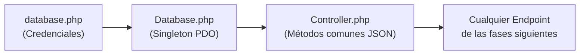

# Fase 1 — Configuración Base y Conexión a Base de Datos

> [!IMPORTANT]
> Esta es la **fase fundacional** del proyecto. Sin estos archivos correctamente configurados, ninguna de las fases siguientes puede funcionar. Aquí se establecen los cimientos de toda la API PHP.

---

## ¿Qué se construye en esta fase?

Se crean los 3 archivos que forman la "infraestructura invisible" del backend: la configuración del entorno, la conexión a la base de datos y el controlador base. El resto del sistema depende completamente de ellos.

---

## Archivos de esta fase

### 0. `.env`
**¿Qué es?** Un archivo de configuración puro — solo almacena datos, no ejecuta lógica.

**¿Qué contiene?**
- Las variables de entorno del sistema.
- Las credenciales para conectarse a la base de datos de desarrollo (MySQL/XAMPP).
- Las credenciales para conectarse a la base de datos de producción (IBM Informix).
- Una variable (ej. `APP_ENV`) que indica si estamos en `development` o `production`.

**¿Por qué importa?**
Centraliza toda la configuración sensible en un solo lugar. Si cambias el host o la contraseña de la base de datos, solo debes editar este archivo — ningún otro archivo del sistema necesita ser modificado.

**Ejemplo conceptual de lo que contendría:**
```php
// En desarrollo (XAMPP/MySQL)
define('DB_DRIVER',   'mysql');
define('DB_HOST',     'localhost');
define('DB_NAME',     'nombre_basededatos');
define('DB_USER',     'usuario');
define('DB_PASS',     'contraseña');
define('DB_CHARSET',  'utf8mb4');

// En producción (Informix)
// define('DB_DRIVER', 'informix');
// define('DB_HOST',   '192.168.x.x');
// ...
```

### 1. `app/Config/database.php`
**¿Qué es?** Un archivo de configuración que recive los valores del archivo .env y los almacena en constantes.

**¿Qué contiene?**
- Las credenciales para conectarse a la base de datos de desarrollo (MySQL/XAMPP).
- Las credenciales para conectarse a la base de datos de producción (IBM Informix).

**¿Por qué importa?**
Centraliza toda la configuración sensible en un solo lugar. Si cambias el host o la contraseña de la base de datos, solo debes editar este archivo — ningún otro archivo del sistema necesita ser modificado.

**Ejemplo conceptual de lo que contendría:**
Aqui se crearian las constantes:
define('DB_DRIVER', getenv('DB_DRIVER') ?: 'MySql');
define('DB_HOST', getenv('DB_HOST') ?: 'localhost');
define('DB_PORT', getenv('DB_PORT') ?: '5000');
...etc

### 2. `app/Core/Database.php`
**¿Qué es?** La clase que gestiona físicamente la conexión a la base de datos. Es la "llave de acceso" al motor de datos.

**¿Qué patrón usa?** **Singleton** — esto significa que sin importar cuántas veces se pida una conexión en el código, siempre se reutiliza la misma, evitando abrir múltiples conexiones innecesarias al servidor.

**¿Qué hace exactamente?**
1. Lee las constantes de `database.php`.
2. Según el driver configurado (`mysql` o `informix`), arma el DSN (string de conexión PDO).
3. Abre la conexión PDO una sola vez y la reutiliza.
4. Expone un método estático `getInstance()` que devuelve esa conexión ya abierta.

**¿Por qué PDO y no mysqli?**
PDO (PHP Data Objects) es una capa de abstracción que funciona con múltiples motores de base de datos. Esto es esencial para poder migrar de MySQL a Informix en la Fase 5 cambiando lo mínimo posible.

**Ejemplo conceptual:**
```php
class Database {
    private static $instance = null;

    public static function getInstance(): \PDO {
        if (self::$instance === null) {
            // leer config y conectar...
            self::$instance = new \PDO($dsn, $user, $pass);
        }
        return self::$instance;
    }
}
```

---

### 3. `app/Core/Controller.php` *(Opcional pero recomendado)*
**¿Qué es?** Una clase base de la que heredarán todos los controladores (endpoints) del sistema.

**¿Qué proporciona?**
- Un método `json($data, $statusCode)` para responder siempre en formato JSON con los headers correctos (`Content-Type: application/json`).
- Un método `getBody()` para leer el cuerpo de la petición HTTP (útil para peticiones POST de n8n).
- Un método `handleError($message)` para devolver errores estructurados de forma uniforme.

**¿Por qué importa?**
Evita repetir las mismas 3–5 líneas de código en cada endpoint. Si mañana decides cambiar el formato de respuesta (ej. agregar un campo `timestamp` a todas las respuestas), lo haces aquí una sola vez y aplica a todo el sistema.

**Ejemplo conceptual:**
```php
class Controller {
    protected function json(array $data, int $status = 200): void {
        http_response_code($status);
        header('Content-Type: application/json');
        echo json_encode($data);
        exit;
    }
}
```

---

## Diagrama del flujo en esta fase



---

## Resultado al terminar la Fase 1

Al finalizar tendrás:
- ✅ Un sistema capaz de conectarse a MySQL (desarrollo) o Informix (producción) con un simple cambio de variable.
- ✅ Una respuesta JSON estandarizada desde cualquier punto de la API.
- ✅ Los cimientos listos para construir los módulos de Socios y Reclamos sobre ellos.

> [!TIP]
> Antes de avanzar a la Fase 2, verifica que puedes conectarte a tu base de datos MySQL local (XAMPP) ejecutando `Database::getInstance()` desde un archivo de prueba. Eso confirma que los cimientos están sólidos.
