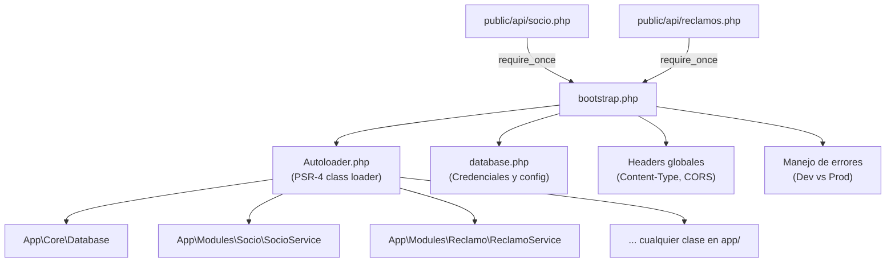

# Fase 4 — Autoloading y Utilidades

> [!NOTE]
> Esta fase es opcional pero **altamente recomendada**. Sin un autoloader, cada archivo PHP necesitaría docenas de líneas `require_once '../../Core/Database.php'` al inicio, lo que es frágil y propenso a errores. Con un autoloader, PHP encuentra las clases automáticamente.

---

## ¿Qué se construye en esta fase?

Solo **2 archivos** que hacen que todo el sistema sea más limpio y mantenible. Son la "infraestructura de conveniencia" que ningún usuario final ve, pero que hace la vida del desarrollador mucho más fácil.

---

## Archivos de esta fase

### 1. `app/Core/Autoloader.php`
**¿Qué es?** Un sistema que le dice a PHP "cuando alguien use una clase que no conoces, búscala en esta carpeta siguiendo este patrón de rutas".

**¿Qué estándar implementa?** PSR-4 — el estándar de la industria para autoloading en PHP. Convierte el namespace de una clase en una ruta de archivo.

**Ejemplo de cómo funciona:**
```
Clase instanciada:  App\Modules\Socio\SocioService
                         ↓ PSR-4 convierte a:
Archivo buscado:    app/Modules/Socio/SocioService.php
```

**¿Qué hace el autoloader?**
Registra una función con `spl_autoload_register()` que PHP llama automáticamente cada vez que encuentra una clase desconocida:
```php
spl_autoload_register(function (string $class): void {
    // convierte "App\Core\Database" → "app/Core/Database.php"
    $path = str_replace('\\', '/', $class) . '.php';
    if (file_exists($path)) {
        require_once $path;
    }
});
```

**¿Por qué no usar Composer directamente?**

| Opción | Ventajas | Desventajas |
|--------|----------|-------------|
| **Autoloader manual** (esta fase) | Sin dependencias externas, funciona en cualquier servidor PHP 7.3 | Más limitado |
| **Composer PSR-4** | Estándar de la industria, soporte para paquetes externos | Requiere instalar Composer |

> [!TIP]
> Para el Sprint actual (PHP puro, sin paquetes externos), el autoloader manual es suficiente. Si en el futuro se decide agregar librerías de terceros, migrar a Composer es trivial.

---

### 2. `app/bootstrap.php`
**¿Qué es?** El **iniciador global** — el primer archivo que se incluye en cualquier endpoint.

**¿Qué hace en una sola línea?** Prepara todo el entorno para que el endpoint pueda funcionar inmediatamente.

**Contenido conceptual:**
```php
<?php
// 1. Cargar el autoloader (habilita el descubrimiento automático de clases)
require_once __DIR__ . '/Core/Autoloader.php';

// 2. Cargar la configuración de base de datos
require_once __DIR__ . '/Config/database.php';

// 3. Configurar el manejo de errores (solo mostrar en desarrollo)
if (APP_ENV === 'development') {
    ini_set('display_errors', 1);
    error_reporting(E_ALL);
} else {
    ini_set('display_errors', 0);
}

// 4. Headers globales para la API
header('Content-Type: application/json');
header('Access-Control-Allow-Origin: *');  // Permitir llamadas desde n8n
```

**¿Cómo lo usan los endpoints?**
```php
// public/api/socio.php — ANTES de bootstrap (muy malo):
require_once '../../app/Core/Database.php';
require_once '../../app/Core/Controller.php';
require_once '../../app/Config/database.php';
require_once '../../app/Data/Interfaces/SocioRepositoryInterface.php';
require_once '../../app/Data/Repositories/MySQL/SocioRepository.php';
require_once '../../app/Modules/Socio/SocioService.php';
// ... más líneas

// public/api/socio.php — CON bootstrap (limpio):
require_once '../../app/bootstrap.php';
// ¡Listo! Todas las clases se cargan automáticamente.
```

---

## Diagrama de cómo bootstrap conecta todo



---

## Resultado al terminar la Fase 4

Al finalizar tendrás:
- ✅ Cualquier endpoint puede arrancar con una sola línea: `require_once '../../app/bootstrap.php'`.
- ✅ No hay `require_once` manuales por todo el código — las clases se descubren automáticamente.
- ✅ La configuración de errores es automática según el entorno (desarrollo vs producción).
- ✅ Los headers de la API (JSON, CORS) se configuran en un solo lugar para toda la API.

> [!CAUTION]
> El archivo `bootstrap.php` **nunca debe contener lógica de negocio**. Su única función es preparar el entorno. Si se convierte en un archivo "relleno" con lógica mezclada, se vuelve difícil de mantener.
