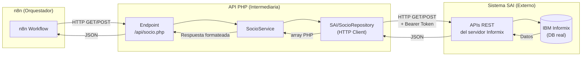
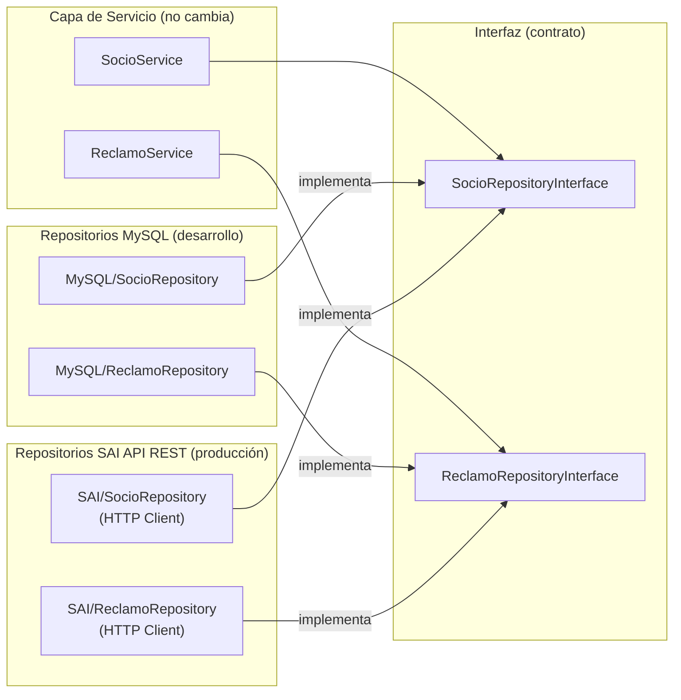

# Fase 5 (Futura) — Integración con APIs REST del Sistema SAI (Informix)

> [!NOTE]
> Esta fase corresponde al **Sprint 4** del proyecto. No se implementa ahora — toda la arquitectura de las fases anteriores fue diseñada *específicamente* para que esta fase sea lo menos disruptiva posible.

---

## ¿Qué se construye en esta fase?

El equipo de producción del sistema SAI proporcionará **endpoints REST** que exponen los datos almacenados en Informix. La API PHP actúa como **capa intermediaria**: recibe las peticiones de n8n, las traduce a llamadas HTTP hacia el SAI, y devuelve la respuesta formateada.

**Lo que cambia:**
1. Crear los repositorios equivalentes que consumen las APIs REST del SAI (mismos métodos de interfaz, distinta implementación interna: HTTP en lugar de SQL).
2. Cambiar una variable de entorno para que los endpoints usen estos repositorios en lugar de los de MySQL local.

**Lo que NO cambia:** Los servicios, el bootstrap, el autoloader y los contratos de interfaz permanecen intactos.

---

## ¿Por qué esto es posible?

Recuerda la estructura de capas:

```
Endpoint PHP → Servicio (lógica) → Repositorio (datos) → [MySQL local / APIs SAI]
```

El **Servicio** nunca supo si estaba hablando con MySQL o con una API externa. Solo usó la interfaz:
- `SocioRepositoryInterface::findByCodigo()`
- `ReclamoRepositoryInterface::createReclamo()`

En la Fase 5 simplemente le pasamos un repositorio que hace peticiones HTTP al SAI en lugar del que hace queries a MySQL. La interfaz sigue siendo la misma — el contrato no cambia.

---

## Archivos de esta fase

### 1. `app/Data/Repositories/SAI/SocioRepository.php`
**¿Qué es?** La misma funcionalidad que `MySQL/SocioRepository.php`, pero usando llamadas HTTP hacia la API REST del sistema SAI.

**¿Qué cambia respecto al de MySQL?**

| Aspecto | MySQL (desarrollo) | SAI API REST (producción) |
|---------|-------------------|--------------------------|
| Fuente de datos | Query SQL a MySQL local | Petición HTTP GET/POST a endpoint SAI |
| Autenticación | DSN + credenciales DB | Token/API Key proporcionado por el equipo SAI |
| Formato de respuesta | Filas PDO | JSON desde la API |
| Dependencia | `pdo_mysql` | `curl` / `file_get_contents` (ya disponible en PHP) |
| Configuración | `DB_HOST`, `DB_NAME`... | `SAI_API_BASE_URL`, `SAI_API_TOKEN` |

**Implementa exactamente los mismos métodos:**
```php
// Misma interfaz, distinta implementación interna
class SAISocioRepository implements SocioRepositoryInterface {

    private string $baseUrl;
    private string $token;

    public function __construct(string $baseUrl, string $token) {
        $this->baseUrl = $baseUrl;
        $this->token   = $token;
    }

    public function findByCodigo(string $codigo): ?array {
        // GET {SAI_API_BASE_URL}/socios/{codigo}
        return $this->get("/socios/{$codigo}");
    }

    public function getDeuda(string $codigo): ?array {
        // GET {SAI_API_BASE_URL}/socios/{codigo}/deuda
        return $this->get("/socios/{$codigo}/deuda");
    }

    public function getHistorialFacturas(string $codigo): array {
        // GET {SAI_API_BASE_URL}/socios/{codigo}/facturas
        return $this->get("/socios/{$codigo}/facturas") ?? [];
    }

    private function get(string $path): ?array {
        $ch = curl_init($this->baseUrl . $path);
        curl_setopt($ch, CURLOPT_RETURNTRANSFER, true);
        curl_setopt($ch, CURLOPT_HTTPHEADER, [
            "Authorization: Bearer {$this->token}",
            "Accept: application/json"
        ]);
        $response = curl_exec($ch);
        curl_close($ch);
        return json_decode($response, true);
    }
}
```

---

### 2. `app/Data/Repositories/SAI/ReclamoRepository.php`
**¿Qué es?** Lo mismo para el módulo de reclamos — replica `MySQL/ReclamoRepository.php` haciendo peticiones HTTP al SAI.

**Métodos que implementa:**
```php
class SAIReclamoRepository implements ReclamoRepositoryInterface {

    public function createReclamo(array $data): int {
        // POST {SAI_API_BASE_URL}/reclamos
        // Retorna el ID del reclamo creado en el sistema SAI
        $response = $this->post("/reclamos", $data);
        return (int) $response['id'];
    }

    public function findByCodigoSocio(string $codigo): array {
        // GET {SAI_API_BASE_URL}/socios/{codigo}/reclamos
        return $this->get("/socios/{$codigo}/reclamos") ?? [];
    }
}
```

---

### 3. Ajuste de los endpoints (sin crear archivos nuevos)

El único cambio en `public/api/socio.php` y `public/api/reclamos.php` es qué repositorio se instancia, controlado por variables de entorno:

```php
// En .env (o config/database.php)
APP_ENV=production
SAI_API_BASE_URL=https://sai.cosmol.com/api/v1   # URL proporcionada por el equipo SAI
SAI_API_TOKEN=tu_token_aqui
```

```php
// En public/api/socio.php — el único cambio:

// ANTES (desarrollo):
$socioRepo = new App\Data\Repositories\MySQL\SocioRepository($pdo);

// DESPUÉS (producción):
$socioRepo = new App\Data\Repositories\SAI\SocioRepository(
    getenv('SAI_API_BASE_URL'),
    getenv('SAI_API_TOKEN')
);
```

> [!TIP]
> En una implementación más avanzada, este cambio puede automatizarse en el `bootstrap.php` usando una **Factory**: una clase que lea `APP_ENV` y devuelva automáticamente el repositorio correcto (MySQL o SAI). Así ni siquiera los endpoints se tocan al cambiar de entorno.

---

## Diagrama del flujo de integración



---

## Diagrama del intercambio de repositorios



---

## Requisitos previos para esta fase

> [!IMPORTANT]
> Antes de iniciar esta fase es necesario coordinar con el equipo del sistema SAI:
> - Obtener la **URL base** de las APIs REST del servidor Informix.
> - Obtener las **credenciales de autenticación** (API Key o Bearer Token).
> - Revisar la **documentación de los endpoints** disponibles y sus formatos de respuesta (JSON).
> - Validar en un entorno de pruebas que los datos devueltos por el SAI son compatibles con los contratos de interfaz existentes.

---

## Resultado al terminar la Fase 5

Al finalizar tendrás:
- ✅ La API PHP conectando al sistema SAI real a través de sus **APIs REST**.
- ✅ **Cero cambios** en los servicios, bootstrap o autoloader.
- ✅ **Sin drivers adicionales** — solo `curl` nativo de PHP, sin compilar `pdo_informix`.
- ✅ Posibilidad de volver a MySQL local en cualquier momento con solo cambiar `APP_ENV`.
- ✅ El sistema completamente funcional y listo para recibir asociados reales de COSMOL.
