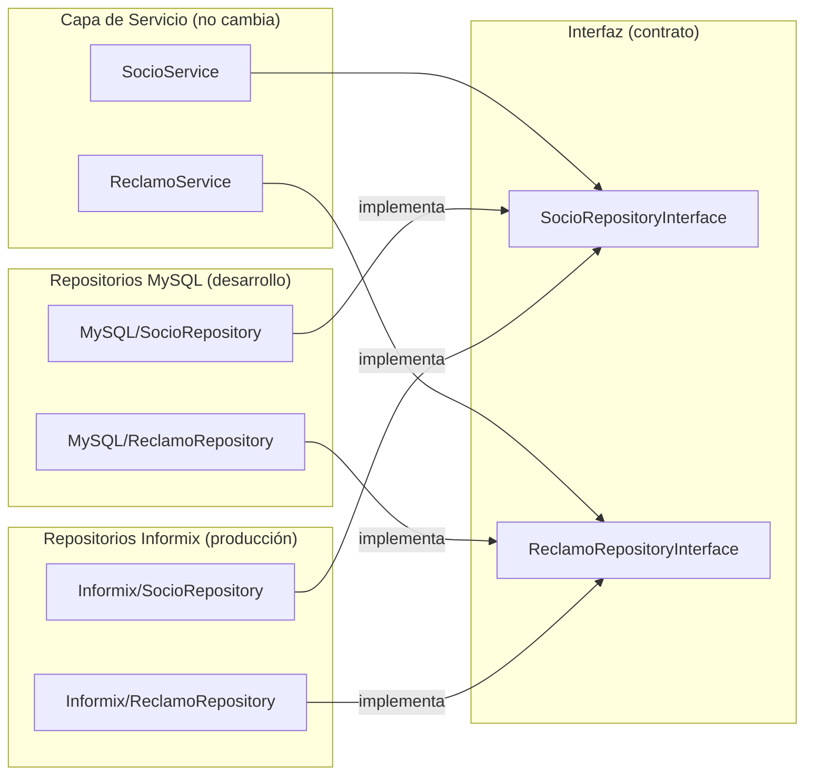

# Fase 5 (Futura) — Migración a Informix

> [!NOTE]
> Esta fase corresponde al **Sprint 4** del proyecto. No se implementa ahora — toda la arquitectura de las fases anteriores fue diseñada *específicamente* para que esta fase sea lo menos disruptiva posible.

---

## ¿Qué se construye en esta fase?

El código PHP **no cambia**. Lo único que se hace es:
1. Crear los repositorios equivalentes para Informix (mismos métodos, distinto SQL).
2. Cambiar una variable de entorno para que los endpoints los usen en lugar de los de MySQL.

**Eso es todo.** Gracias al patrón repositorio de las fases anteriores, no hay que tocar ni el Servicio ni el bootstrap ni los endpoints.

---

## ¿Por qué esto es posible?

Recuerda la estructura de capas:

```
Endpoint PHP → Servicio (lógica) → Repositorio (datos) → Base de Datos
```

El **Servicio** nunca supo si estaba hablando con MySQL o Informix. Solo usó la interfaz:
- `SocioRepositoryInterface::findByCodigo()`
- `ReclamoRepositoryInterface::createReclamo()`

En la Fase 5 simplemente le pasamos un repositorio Informix en lugar del MySQL. La interfaz sigue siendo la misma — el contrato no cambia.

---

## Archivos de esta fase

### 1. `app/Data/Repositories/Informix/SocioRepository.php`
**¿Qué es?** La misma funcionalidad que `MySQL/SocioRepository.php`, pero usando la sintaxis y drivers de IBM Informix.

**¿Qué cambia respecto al de MySQL?**

| Aspecto | MySQL | Informix |
|---------|-------|---------|
| DSN de conexión | `mysql:host=...` | `informix:...` |
| Placeholders | `:codigo` (named) | `?` (posicional, según driver) |
| Sintaxis de fechas | `NOW()` | `CURRENT` |
| Driver PHP | `pdo_mysql` | `pdo_informix` |
| Alias | `AS nombre` | similar pero con particularidades |

**Implementa exactamente los mismos métodos:**
```php
// Misma interfaz, distinta implementación interna
class InformixSocioRepository implements SocioRepositoryInterface {
    public function findByCodigo(string $codigo): ?array { /* SQL Informix */ }
    public function getDeuda(string $codigo): ?array      { /* SQL Informix */ }
    public function getHistorialFacturas(string $codigo): array { /* SQL Informix */ }
}
```

---

### 2. `app/Data/Repositories/Informix/ReclamoRepository.php`
**¿Qué es?** Lo mismo para el módulo de reclamos — replica `MySQL/ReclamoRepository.php` con la sintaxis de Informix.

**Métodos que implementa:**
```php
class InformixReclamoRepository implements ReclamoRepositoryInterface {
    public function createReclamo(array $data): int        { /* INSERT Informix */ }
    public function findByCodigoSocio(string $codigo): array { /* SELECT Informix */ }
}
```

---

### 3. Ajuste de los endpoints (sin crear archivos nuevos)

El único cambio en `public/api/socio.php` y `public/api/reclamos.php` es qué repositorio se instancia, controlado por una variable de entorno en `database.php`:

```php
// En database.php (o .env)
define('APP_ENV', 'production');   // Cambia de 'development' a 'production'
define('DB_DRIVER', 'informix');   // Cambia de 'mysql' a 'informix'
```

```php
// En public/api/socio.php — el único cambio:

// ANTES (desarrollo):
$socioRepo = new App\Data\Repositories\MySQL\SocioRepository($pdo);

// DESPUÉS (producción):
$socioRepo = new App\Data\Repositories\Informix\SocioRepository($pdo);
```

> [!TIP]
> En una implementación más avanzada, este cambio puede automatizarse en el `bootstrap.php` usando una **Factory**: una clase que lea `DB_DRIVER` y devuelva automáticamente el repositorio correcto. Así ni siquiera los endpoints se tocan.

---

## Diagrama del intercambio de repositorios



---

## Resultado al terminar la Fase 5

Al finalizar tendrás:
- ✅ La API PHP conectada directamente a IBM Informix en producción.
- ✅ **Cero cambios** en los servicios, bootstrap o autoloader.
- ✅ Posibilidad de volver a MySQL en cualquier momento con solo cambiar la variable de entorno.
- ✅ El sistema completamente funcional y listo para recibir asociados reales de COSMOL.

> [!CAUTION]
> Antes de esta fase es obligatorio compilar el driver `pdo_informix` dentro del contenedor Docker de PHP. Esto requiere acceso al servidor Informix de producción para probar la conexión. Se trabaja en el Sprint 4.
