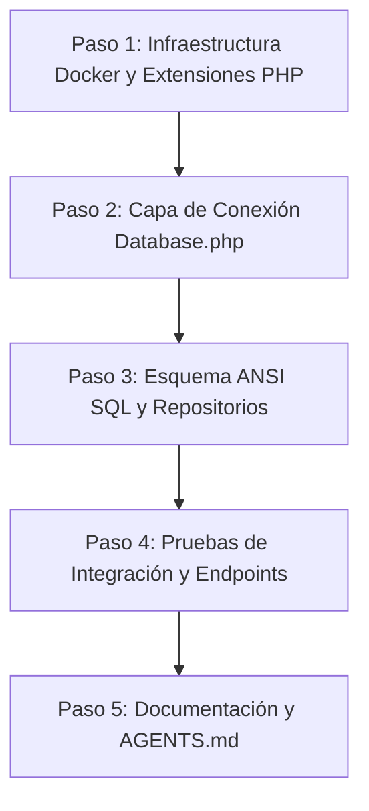

# Plan de Implementación y Arquitectura: Migración a PostgreSQL 13.22-alpine

> **Documento de Diseño Técnico y Arquitectura de Persistencia**  
> **Proyecto:** Chatbot COSMOL (WhatsApp)  
> **Responsable:** Chichico Fabián  
> **Fecha:** 2026-08-18  
> **Estado:** Propuesto / Pendiente de Aprobación  

---

## 1. Objetivos y Justificación Técnica

### 1.1 Compatibilidad PHP 7.3 (`pdo_pgsql`) y PostgreSQL 13.22-alpine
* **Soporte y Estabilidad del Driver:** PHP 7.3 cuenta con soporte maduro y nativo para el driver `pdo_pgsql` a través de las librerías cliente `libpq-dev`. El protocolo cliente/servidor (PostgreSQL Frontend/Backend Protocol v3.0) de PostgreSQL 13 es 100% compatible con las versiones de `libpq` provistas en Debian Buster (base de la imagen `php:7.3-apache`).
* **Optimización de Recursos en Docker:** La imagen oficial `postgres:13.22-alpine` posee un tamaño de ~80 MB frente a los ~380 MB de `mysql:5.7`, reduciendo tiempos de compilación/descarga, consumo de memoria RAM y acelerando el tiempo de inicialización de los servicios en desarrollo local.
* **Transaccionalidad y Rigor de Tipos:** PostgreSQL ofrece cumplimiento estricto del estándar ACID, validación rigurosa de tipos de datos e integridad referencial sólida.

### 1.2 Restricciones de Modelado: Estándar ANSI SQL (Ruta a IBM Informix)
La arquitectura del proyecto contempla que la base de datos de desarrollo simule fielmente las estructuras del sistema central de COSMOL (SAI) para luego migrar en producción hacia **IBM Informix IDS / 4GL** (Fase 5 / Sprint 4). Por tanto, se prohíbe el uso de características exclusivas de PostgreSQL o MySQL y se adopta estrictamente el estándar **ANSI SQL**:

1. **Tipos de Datos Permitidos (Estándar ANSI):**
   * **Cadenas de Texto:** `VARCHAR(n)` con longitudes acotadas (ej. `VARCHAR(20)`, `VARCHAR(80)`, `VARCHAR(255)`).
   * **Identificadores y Claves:** `INT` / `INTEGER` para llaves primarias y foráneas.
   * **Importes Monetarios:** `NUMERIC(10,2)` o `DECIMAL(10,2)` para facturación y deudas, evitando imprecisiones de coma flotante (`FLOAT`/`DOUBLE`).
   * **Fechas y Tiempos:** `DATE` para fechas contables (`YYYY-MM-DD`) y `TIMESTAMP` para marcas temporales con fecha y hora.
   * **Estados y Banderas:** `BOOLEAN` (compatible con PostgreSQL y convertible a `SMALLINT 0/1` en Informix).

2. **Restricciones y Prohibiciones Explícitas:**
   * ❌ **Prohibido:** `ON DUPLICATE KEY UPDATE` (sintaxis propietaria de MySQL). El manejo de persistencia/upsert se realizará mediante verificación lógica previa (`SELECT` -> `INSERT`/`UPDATE`) o patrones ANSI portables.
   * ❌ **Prohibido:** `INSERT IGNORE` o `REPLACE INTO`.
   * ❌ **Prohibido:** `NOW()`; se debe utilizar la constante estándar ANSI `CURRENT_TIMESTAMP`.
   * ❌ **Prohibido:** Cláusulas de autogeneración propietarias como `ON UPDATE CURRENT_TIMESTAMP`. La actualización de marcas temporales se manejará a nivel de aplicación o trigger ANSI.
   * ❌ **Prohibido:** `AUTO_INCREMENT`; se usará el estándar de secuencias ANSI `SERIAL` / `IDENTITY`.
   * ❌ **Prohibido:** Tipos de datos o funciones exclusivas de Postgres como `JSONB`, `UUID` nativo, arrays de Postgres (`TEXT[]`) o extensiones externas en las tablas del negocio.

---

## 2. Impacto y Archivos Afectados

| Archivo | Tipo de Cambio | Justificación Técnica |
| :--- | :--- | :--- |
| [`dockerfile`](file:///c:/Users/Lenovo/Desktop/Cosmol-Chatbot/dockerfile) | **Modificación** | Instalar paquete `libpq-dev` y compilar extensión `pdo_pgsql` en PHP (manteniendo `pdo_mysql` para soporte de rollback instantáneo). |
| [`docker-compose.yml`](file:///c:/Users/Lenovo/Desktop/Cosmol-Chatbot/docker-compose.yml) | **Modificación** | Reemplazar servicio `db` con `postgres:13.22-alpine`, puerto `5432:5432`, volumen `postgres_data`, variables `POSTGRES_*` y healthcheck con `pg_isready`. |
| [`.env`](file:///c:/Users/Lenovo/Desktop/Cosmol-Chatbot/.env) | **Modificación** | Actualizar `DB_DRIVER=pgsql`, `DB_PORT=5432`, `DB_NAME=chatbot_cosmol`, `DB_USER=cosmol`, `DB_PASSWORD=...`. |
| [`env.example`](file:///c:/Users/Lenovo/Desktop/Cosmol-Chatbot/env.example) | **Modificación** | Reflejar los nuevos parámetros de configuración de PostgreSQL para el equipo de desarrollo. |
| [`app/Config/database.php`](file:///c:/Users/Lenovo/Desktop/Cosmol-Chatbot/app/Config/database.php) | **Modificación** | Actualizar valores por defecto de fallback (`DB_DRIVER => pgsql`, `DB_PORT => 5432`, charset UTF-8). |
| [`app/Core/Database.php`](file:///c:/Users/Lenovo/Desktop/Cosmol-Chatbot/app/Core/Database.php) | **Modificación** | Incorporar la construcción del DSN para PostgreSQL: `pgsql:host=...;port=...;dbname=...;options='--client_encoding=UTF8'`. |
| [`database/init.sql`](file:///c:/Users/Lenovo/Desktop/Cosmol-Chatbot/database/init.sql) | **Modificación** | Reescribir esquemas DDL (tablas) y DML (seeds) bajo sintaxis ANSI SQL (`SERIAL`, `TIMESTAMP`, `BOOLEAN`, `NUMERIC`, `CURRENT_TIMESTAMP`). |
| [`app/Data/Repositories/MySQL/ReclamoRepository.php`](file:///c:/Users/Lenovo/Desktop/Cosmol-Chatbot/app/Data/Repositories/MySQL/ReclamoRepository.php) | **Refactor** | Sustituir la función `NOW()` por la constante estándar ANSI `CURRENT_TIMESTAMP`. |
| [`app/Data/Repositories/MySQL/RepositorioSessionMySQL.php`](file:///c:/Users/Lenovo/Desktop/Cosmol-Chatbot/app/Data/Repositories/MySQL/RepositorioSessionMySQL.php) | **Refactor** | Reemplazar la cláusula `ON DUPLICATE KEY UPDATE` por un mecanismo portable compatible con cualquier motor SQL. |
| [`Docs/ESTRUCTURA.md`](file:///c:/Users/Lenovo/Desktop/Cosmol-Chatbot/Docs/ESTRUCTURA.md) | **Modificación** | Actualizar diagramas de arquitectura y referencias a la base de datos de desarrollo. |
| [`AGENTS.md`](file:///c:/Users/Lenovo/Desktop/Cosmol-Chatbot/AGENTS.md) | **Modificación** | Actualizar la sección de Base de Datos y stack tecnológico registrando PostgreSQL 13.22-alpine. |

---

## 3. Fases Paso a Paso del Plan



### Paso 1: Configuración de Contenedores Docker y Activación de Extensiones PHP
1. **Actualización de `Dockerfile`:**
   ```dockerfile
   FROM php:7.3-apache
   WORKDIR /app
   RUN a2enmod rewrite

   # Instalar dependencias para PostgreSQL y compilar drivers (manteniendo pdo_mysql para fallback)
   RUN apt-get update && apt-get install -y libpq-dev \
       && docker-php-ext-install pdo pdo_pgsql pdo_mysql mysqli \
       && apt-get clean && rm -rf /var/lib/apt/lists/*
   ```

2. **Actualización de `docker-compose.yml`:**
   ```yaml
   # Base de Datos (PostgreSQL 13.22-alpine)
   db:
     image: postgres:13.22-alpine
     container_name: cosmol_postgres
     ports:
       - "5432:5432"
     environment:
       - POSTGRES_DB=${DB_NAME}
       - POSTGRES_USER=${DB_USER}
       - POSTGRES_PASSWORD=${DB_PASSWORD}
     volumes:
       - postgres_data:/var/lib/postgresql/data
       - ./database/init.sql:/docker-entrypoint-initdb.d/init.sql
     healthcheck:
       test: ["CMD-SHELL", "pg_isready -U ${DB_USER} -d ${DB_NAME}"]
       interval: 10s
       timeout: 5s
       retries: 5
   ```
   * Actualizar sección de volúmenes: declarar `postgres_data`.

3. **Ajuste de Variables de Entorno (`.env` y `env.example`):**
   ```env
   DB_DRIVER=pgsql
   DB_HOST=db
   DB_PORT=5432
   DB_NAME=chatbot_cosmol
   DB_USER=cosmol
   DB_PASSWORD=secreto_bd
   ```

---

### Paso 2: Refactorización de la Capa de Conexión `database.php` y `Database.php`

1. **Configuración (`app/Config/database.php`):**
   ```php
   define('DB_DRIVER', getenv('DB_DRIVER') ?: 'pgsql');
   define('DB_HOST', getenv('DB_HOST') ?: 'db');
   define('DB_PORT', getenv('DB_PORT') ?: '5432');
   define('DB_NAME', getenv('DB_NAME') ?: 'chatbot_cosmol');
   define('DB_USER', getenv('DB_USER') ?: 'cosmol');
   define('DB_PASSWORD', getenv('DB_PASSWORD') ?: '');
   define('DB_CHARSET', getenv('DB_CHARSET') ?: 'utf8');
   ```

2. **Singleton de Conexión (`app/Core/Database.php`):**
   * Añadir resolución de DSN para el driver `pgsql`:
   ```php
   if ($driver === 'pgsql' || $driver === 'postgres') {
       $dsn = "pgsql:host={$host};port={$port};dbname={$dbName};options='--client_encoding=UTF8'";
   } elseif ($driver === 'informix') {
       $dsn = "informix:host={$host};service={$port};database={$dbName};";
   } else {
       $dsn = "mysql:host={$host};port={$port};dbname={$dbName};charset={$charset}";
   }
   ```

---

### Paso 3: Traducción y Creación de Schemas DDL/DML bajo el Estándar ANSI SQL

1. **Esquema Inicial (`database/init.sql`):**
   ```sql
   -- =========================================================================
   -- Esquema ANSI SQL para Desarrollo Local (PostgreSQL 13.22-alpine / Informix)
   -- =========================================================================

   CREATE TABLE IF NOT EXISTS socio (
       codigo_socio INT PRIMARY KEY,
       ci VARCHAR(20) NOT NULL,
       nombre VARCHAR(80) NOT NULL,
       apellido VARCHAR(80) NOT NULL,
       telefono VARCHAR(20) NOT NULL,
       direccion VARCHAR(255) DEFAULT 'Sin dirección',
       estado_conexion BOOLEAN NOT NULL DEFAULT TRUE
   );

   CREATE TABLE IF NOT EXISTS reclamo (
       id SERIAL PRIMARY KEY,
       tipo_reclamo VARCHAR(50) NOT NULL,
       descripcion VARCHAR(500),
       direccion VARCHAR(255) NOT NULL,
       estado VARCHAR(20) DEFAULT 'PENDIENTE',
       fecha_creacion TIMESTAMP DEFAULT CURRENT_TIMESTAMP,
       codigo_socio INT NOT NULL,
       CONSTRAINT fk_reclamo_socio FOREIGN KEY (codigo_socio) REFERENCES socio(codigo_socio)
   );

   CREATE TABLE IF NOT EXISTS factura (
       id SERIAL PRIMARY KEY,
       codigo_socio INT NOT NULL,
       periodo VARCHAR(20) NOT NULL,
       monto NUMERIC(10,2) NOT NULL,
       estado VARCHAR(20) DEFAULT 'PENDIENTE',
       fecha_emision DATE,
       fecha_vencimiento DATE,
       CONSTRAINT fk_factura_socio FOREIGN KEY (codigo_socio) REFERENCES socio(codigo_socio)
   );

   CREATE TABLE IF NOT EXISTS chat_session (
       telefono_whatsapp VARCHAR(20) PRIMARY KEY,
       codigo_socio INT NULL,
       estado_actual VARCHAR(50) DEFAULT 'AWAITING_CODE',
       intentos_fallidos INT DEFAULT 0,
       ultima_interaccion TIMESTAMP DEFAULT CURRENT_TIMESTAMP
   );

   -- -------------------------------------------------------------------------
   -- DATOS DE PRUEBA (SEEDS)
   -- -------------------------------------------------------------------------

   INSERT INTO socio (codigo_socio, ci, nombre, apellido, telefono, direccion, estado_conexion) 
   VALUES (267657, '1234567', 'Juan', 'Pérez', '59170000000', 'Av. Prueba 123', TRUE);

   INSERT INTO factura (codigo_socio, periodo, monto, estado, fecha_emision, fecha_vencimiento) 
   VALUES (267657, 'Mayo-2026', 95.50, 'PAGADA', '2026-05-01', '2026-05-15');

   INSERT INTO factura (codigo_socio, periodo, monto, estado, fecha_emision, fecha_vencimiento) 
   VALUES (267657, 'Junio-2026', 107.60, 'PENDIENTE', '2026-06-01', '2026-06-15');

   INSERT INTO factura (codigo_socio, periodo, monto, estado, fecha_emision, fecha_vencimiento) 
   VALUES (267657, 'Julio-2026', 114.30, 'PENDIENTE', '2026-07-01', '2026-07-15');
   ```

2. **Adaptación de Repositorios:**
   * En `app/Data/Repositories/MySQL/ReclamoRepository.php`: cambiar llamada `NOW()` a `CURRENT_TIMESTAMP`.
   * En `app/Data/Repositories/MySQL/RepositorioSessionMySQL.php`: refactorizar método `saveSession()` para utilizar una verificación previa de existencia (`SELECT`), seguida de `INSERT` o `UPDATE` atómico según corresponda, garantizando portabilidad absoluta.

---

### Paso 4: Pruebas de Integración de Endpoints

Se ejecutarán pruebas funcionales vía peticiones HTTP contra los endpoints expuestos en el puerto `8000`:
* **`public/api/socio.php`:**
  * `GET /api/socio.php?cod_socio=267657` con cabecera `X-Internal-Token`.
  * Verificación: Devuelve datos del socio en estructura JSON estandarizada.
* **`public/api/factura.php`:**
  * `GET /api/factura.php?cod_socio=267657` con cabecera `X-Internal-Token`.
  * Verificación: Devuelve listado de facturas y montos en tipo numérico decimal exacto.
* **`public/api/reclamos.php`:**
  * `POST /api/reclamos.php` enviando JSON: `{"codigo_socio":"267657","tipo_reclamo":"Agua turbia","descripcion":"Sedimento en el grifo"}`.
  * Verificación: Inserción correcta en la tabla `reclamo` y retorno del nuevo ID serial generado.
* **`public/api/session.php`:**
  * Operaciones `action=get`, `action=update` y `action=reset` para validar persistencia de sesiones de WhatsApp y actualización de `ultima_interaccion`.

---

## 4. Plan de Contingencia / Rollback

En caso de cualquier incompatibilidad durante el despliegue o las pruebas, se dispone del siguiente protocolo de reversión rápida:

1. **Soporte de Driver Dual:** Como el `Dockerfile` mantendrá instaladas simultáneamente las extensiones `pdo_mysql` y `pdo_pgsql`, no es necesario reconstruir la imagen PHP desde cero para regresar a MySQL.
2. **Reversión de Variables (`.env`):**
   ```env
   DB_DRIVER=mysql
   DB_PORT=3306
   ```
3. **Reversión de Servicios (`docker-compose.yml`):**
   * Restaurar el servicio `db` apuntando a `mysql:5.7` con volumen `mysql_data`.
4. **Reinicio Limpio:**
   ```bash
   docker compose down -v
   docker compose up -d --build
   ```

---

## 5. Documentación y Actualización de `AGENTS.md`

1. **Actualización de [AGENTS.md](file:///c:/Users/Lenovo/Desktop/Cosmol-Chatbot/AGENTS.md):**
   * Modificar la sección **2. ARQUITECTURA Y TECNOLOGÍAS (Base de Datos)**:
     * *Desarrollo Local:* PostgreSQL 13.22-alpine en Docker utilizando el estándar ANSI SQL (VARCHAR, INT, NUMERIC, TIMESTAMP, BOOLEAN) para simular el sistema SAI y garantizar la futura migración a IBM Informix.
   * Modificar la sección **5. FASES ÁGILES DE DESARROLLO (Sprint 1)** reflejando PostgreSQL en lugar de MySQL/XAMPP.
2. **Preservación del Plan:** Este documento queda alojado en `Docs/chichico-fabian/plan_imple_Mdocker.md` como la referencia canónica de arquitectura de persistencia para el proyecto.
