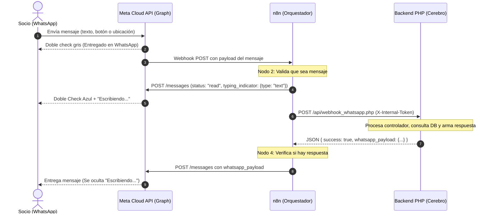

# Documentación de Flujos en n8n - Chatbot COSMOL

Este documento detalla la arquitectura de los nodos dentro de n8n para el Chatbot de WhatsApp de COSMOL bajo el patrón **Centralizado MVC**, incluyendo la integración estética de indicadores visuales (Doble Check Azul y "Escribiendo...").

---

## 1. Arquitectura Centralizada MVC

En este diseño, **n8n actúa como Proxy Orquestador de Mensajería**, mientras que el backend en PHP puro (`/api/webhook_whatsapp.php`) actúa como el **Cerebro (Controlador/Modelo)**. Toda la lógica de negocio, validaciones de deuda, menús interactivos y captura de reclamos se ejecutan en PHP.



---

## 2. Indicadores Estéticos: Doble Check Azul y "Escribiendo..."

### 2.1 ¿Cómo funcionan los estados en WhatsApp?
1. **Recibido / Entregado (Doble check gris):** Se gestiona automáticamente por la infraestructura de WhatsApp en cuanto el mensaje llega a los servidores de Meta. No requiere ningún nodo ni llamada de API.
2. **Leído (Doble check azul):** Notifica al socio que su mensaje ya fue abierto. Se logra enviando a Meta `status: "read"` con el `message_id` correspondiente.
3. **Escribiendo... (Typing Indicator):** Muestra la animación de 3 puntos suspensivos ("escribiendo...") en la parte superior del chat. En la API oficial de Meta Cloud API, se envía junto con el acuse de lectura mediante `"typing_indicator": { "type": "text" }`.

### 2.2 Características Técnicas del Nodo Estético
- **Costo Financiero:** **$0.00 USD**. Meta no factura conversaciones ni mensajes por enviar actualizaciones de estado (`status: "read"`) ni indicadores de escritura.
- **Cancelación Automática:** Meta oculta el indicador "escribiendo..." de inmediato en cuanto se entrega la respuesta final (Nodo 5) o tras transcurrir 25 segundos.
- **Petición Unificada:** Se ejecuta en una sola llamada HTTP rápida (~150ms) en lugar de dos llamadas separadas, optimizando el tiempo de respuesta al socio.

### 2.3 Especificación del Payload hacia Meta
```json
{
  "messaging_product": "whatsapp",
  "status": "read",
  "message_id": "{{ $('2. ¿Es un mensaje válido?').item.json.body.entry[0].changes[0].value.messages[0].id }}",
  "typing_indicator": {
    "type": "text"
  }
}
```

---

## 3. Resiliencia y Compatibilidad n8n v1

Para garantizar que una eventual lentitud o fallo de Meta nunca bloquee la respuesta del chatbot, el nodo estético cuenta con las siguientes salvaguardas:

1. **Continue on Fail (`onError: "continueRegularOutput"`):** Si Meta tarda, responde error 400/500 o el socio tiene deshabilitadas las confirmaciones de lectura en su privacidad de WhatsApp, n8n continúa el flujo normalmente hacia PHP sin detenerse.
2. **Timeout estricto de 3.000 ms:** Si la conexión con Meta se demora más de 3 segundos, se interrumpe y se prosigue con el procesamiento del mensaje.
3. **Inmunidad de Referencias:** Tanto el nodo de PHP (Nodo 3) como el de respuesta final (Nodo 5) extraen el teléfono y mensaje directamente desde `$('2. ¿Es un mensaje válido?')`, por lo que cualquier modificación o error en el nodo estético no corrompe los datos.
4. **Versión de Nodo:** Configurado con `typeVersion: 4.2` para máxima compatibilidad con n8n 1.x (`docker.n8n.io/n8nio/n8n:1`).

---

## 4. Archivos de Flujo Disponibles

Los archivos JSON exportables se encuentran en `Docs/plan_n8n/n8n-workflows/`:

| Archivo | Descripción |
|---|---|
| [`04_Flujo_Centralizado_MVC.json`](file:///d:/Cosmol-Chatbot/Docs/plan_n8n/n8n-workflows/04_Flujo_Centralizado_MVC.json) | Flujo base sin indicadores estéticos. |
| [`04_Flujo_Centralizado_MVC_Con_Estetica.json`](file:///d:/Cosmol-Chatbot/Docs/plan_n8n/n8n-workflows/04_Flujo_Centralizado_MVC_Con_Estetica.json) | **Flujo recomendado**: Incluye Check Azul + "Escribiendo..." con alta resiliencia. |
| [`05_Cron_Sincronizador_Reportes.json`](file:///d:/Cosmol-Chatbot/Docs/plan_n8n/n8n-workflows/05_Cron_Sincronizador_Reportes.json) | Flujo programado para sincronización de reportes. |

---

## 5. Instrucciones de Importación en n8n

1. Abrir la interfaz web de n8n (ej. `https://chatbot.cosmol.com.bo:8081` o `http://localhost:5678`).
2. Ir a **Workflows** y hacer clic en **Add Workflow** (o abrir el flujo existente).
3. Abrir el menú de opciones (tres puntos `...` arriba a la derecha) y seleccionar **Import from File** o **Import from URL / Clipboard**.
4. Pegar el contenido del archivo [`04_Flujo_Centralizado_MVC_Con_Estetica.json`](file:///d:/Cosmol-Chatbot/Docs/plan_n8n/n8n-workflows/04_Flujo_Centralizado_MVC_Con_Estetica.json).
5. Verificar que las credenciales asociadas a Meta (`NLmPF0csahvYQHLM`) y el token interno de PHP (`c4b9d031e13f41249e0c90494fbdb96a2982d6b3fcb5962b9a715a6b0c2a71d0`) estén seleccionados.
6. Guardar cambios (**Save**) y activar el interruptor (**Active**).
